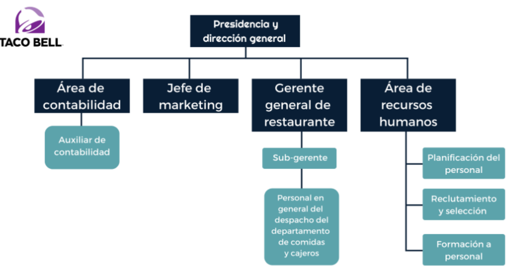

# **Activitat 2.1 Creació i Gestió d’una Empresa**

## MÒDUL: Desenvolupament d'aplicacions multiplataforma

RA2: Implanta sistemes ERP-CRM interpretant la documentació tècnica i identificant les diferents opcions i mòduls.

## RECURSOS

 - Teoria RA2

## CONDICIONS DE TREBALL

 - Treball individual.
 - Entregar al Moodle l'enllaç del github.
 - Github:
   - Treballar en el mateix repositori de la **RA1**.
   - Crear una branca (al terminal) de nom **ra2** i ubicar-se a la branca (**git checkout ra2**).
   - Al acabar l'activitat, fusionar la branca **ra2** a la branca **main** del github.    

## AVALUACIÓ

 - Activitat avaluable amb nota de 0 a 100.
 - Entregar l'activitat a la data indicada.
 - Treballar a la branca **ra2**.
 - Entregar en format **.md** (markdown) amb la mateixa nomenclatura que el de l'activitat actual.

## ENUNCIAT

Crear una empresa fictícia que us agradi i recrear els seus processos i funcionament. 

# **Part 1 - Creació i planificació:**

### **Definició de l’empresa** 

* Nom, missió i visió.  
* Sector d’activitat i productes/serveis.  
* Organigrama bàsic de rols, exemple:

  

* Model de negoci (B2B, B2C, etc.).  
* Forma jurídica (SL, SA, etc).  
* Pressupost que teniu disponible.

### **Planificació del flux de processos**

* Clients i proveïdors ficticis.  
* Departaments.  
* Productes/serveis.  
* Treballadors.  
* Processos: fabricació, recursos humans, informes.  
* Explicació d’un flux complet:  
  * Comanda de client → compra a proveïdor → entrega → factura.  
* Diagrama amb [Drawio](https://www.drawio.com/) per ajudar-vos.

# **Part 2 - Implantació:**

* Crear la BBDD  
* Activar els mòduls corresponents  
* Crear els proveïdors  
* Crear els productes o serveis  
* Crear el clients  
* Crear usuaris / empleats

# **Part 3 - Gestió:**

Guia explicativa acompañada de captures de pantalla del flux de la vostra empresa desde el moment d’una compra o contractació d’un servei fins al cobrament. Simple pero entendible.
