# Pràctica 4

## MÒDUL: Desenvolupament d'aplicacions multiplataforma

RA4: Adapta sistemes ERP-CRM identificant els requeriments d'un supòsit empresarial i utilitzant les eines proporcionades per aquests.

## RECURSOS

 - Teoria RA4

## CONDICIONS DE TREBALL

 - Treball individual.
 - Entregar al Moodle l'enllaç del github.
 - Github:
   - Treballar en el mateix repositori de la **RA1**.
   - Crear una branca (al terminal) de nom **ra4** i ubicar-se a la branca (**git checkout ra4**).
   - Al acabar l'activitat, fusionar la branca **ra4** a la branca **main** del github.    

## AVALUACIÓ

 - Activitat avaluable amb nota de 0 a 100.
 - Entregar l'activitat a la data indicada.
 - Treballar a la branca **ra4**.
 - Entregar en format **.md** (markdown) amb la mateixa nomenclatura que el de l'activitat actual.

## ENUNCIAT

Treballant sobre una base de dades existent, afegirem camps als formularis de producte i de client, en aquestes imatges es mostren els camps que s'afegiran:

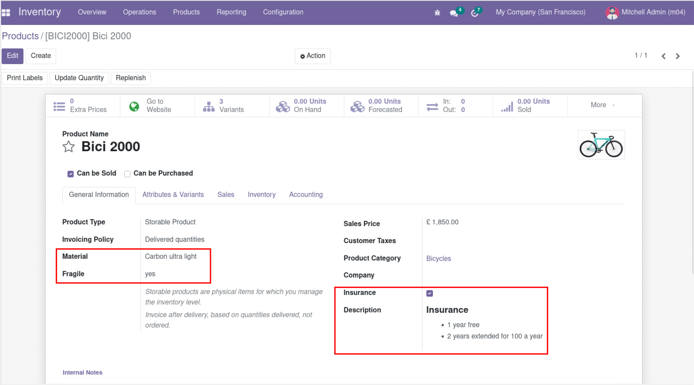 

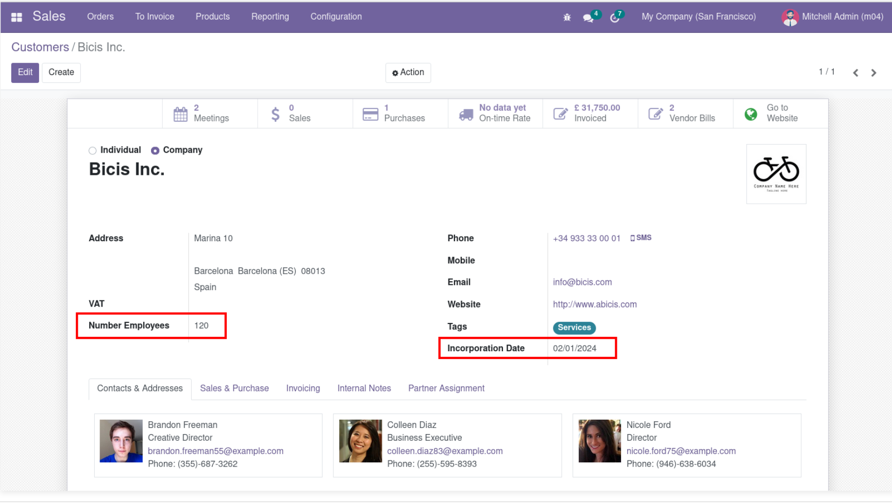 

En aquesta pràctica treballem amb Odoo com si fóssim un usuari avançat, des de **Developer Mode**.

**Note**

* A la tasca del moodle, entrega un document que contingui les captures que es demanen en aquesta pràctica.

## 1. Settings

Des de configuració general, activem el mode de desenvolupador, es troba al final de tots.

`Settings > General Settings > Activate the developer mode.`

## 2. Product

Si es vol afegir un camp en el formulari en concret, per saber quines són les vistes que s'han de modificar, el millor, és accedir a aquest formulari i consultar la vista i els camps.

Realitzarem un canvi al formulari de producte, per tant, accedirem a un producte per consultar el model i les vistes a modificar.

### 2.1 Crear camp del formulari

Seleccionar un producte.

`Inventory > Products > Products (Select a product)`

Per crear un nou camp (*field*), anem a la icona del "**Bug**" i cliquem a "**View Fields**" (Vista de Camps):

`bug > View Fields`

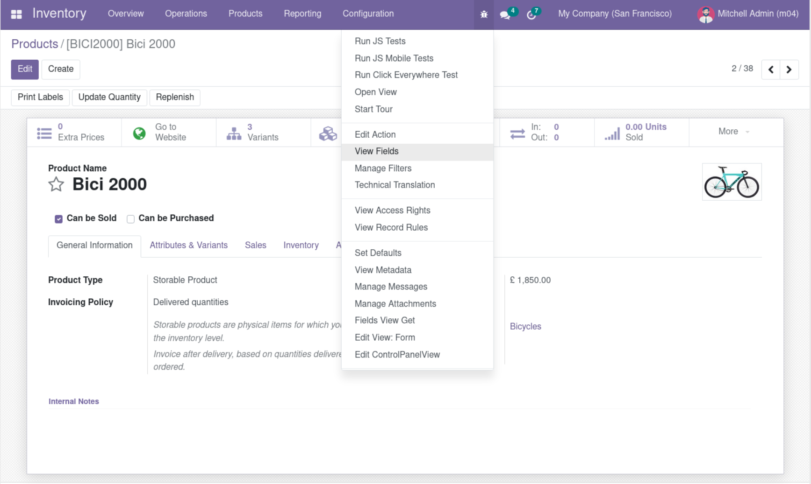 

Aquí ens mostrarà tots els camps disponibles:

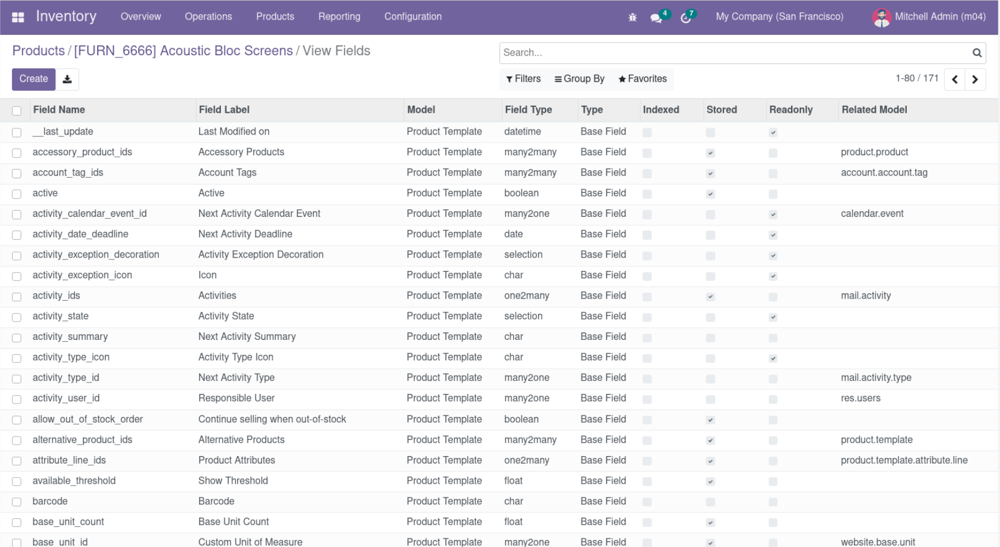 

Crear un nou camp (fer clic al botó **Create**).

**Nous camps**

Tots els nous camps haurien de començar amb "**x_**" per identificar-los més fàcilment i diferenciar-los dels camps estàndards de l'aplicatiu.

**Product Template**

El model a modificar és "**Product Template**".

En aquest exemple, afegim un camp de tipus text amb les següents dades:

* Field name: **x\_material**  
* Field label: **Material**  
* Field type: **text** (Tipus d'entrada de dades)  
* Model: **Product Template**"  
* Field Help: **Enter type of material** (text que ens proporciona quan cliquem l'ajuda)

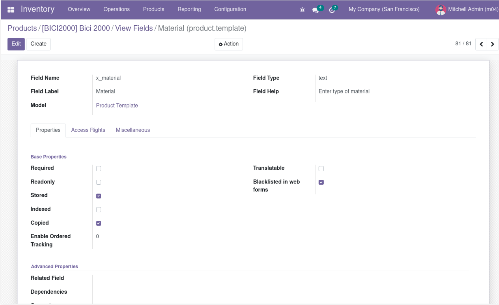 

**ADJUNTAR CAPTURA DE PANTALLA**

Mostra els detalls del camp.

**Tipus de camps**

Els diferents tipus de camps són els següents:

* Char: strings  
* Text: textos llargs  
* Selection: llistes de parells valor/descripció  
* Html  
* Binary per imatges, docs  
* Boolean  
* Date  
* Datetime  
* Integer  
* Float  
* Monetary

Possibles atributs dels camps:

* string: l'etiqueta del camp  
* size (per als char)  
* translate: True/False  
* default: valor per defecte  
* help: tooltip  
* groups: per restringir accés a certs grups states  
* copy: flag per quan es duplica el registre  
* index: si cal crear index a la BD  
* readonly  
* require  
* sanitize: per netejar o filtrar (white list) contingut html. (sanitize_tags | sanitize_attributes | sanitize_style | strip_style | strip_class)  
* company_dependent

Camps relacionals: ens permeten establir relacions entre les dades de diferents taules

* many2one  
* many2many  
* one2many

### 2.1 Modificar la Vista del Formulari

Tornem al formulari de producte (seleccionar un producte).

Anem a la icona del "**Bug**" i cliquem a "**Edit View: Form**" (Editar vista: Form):

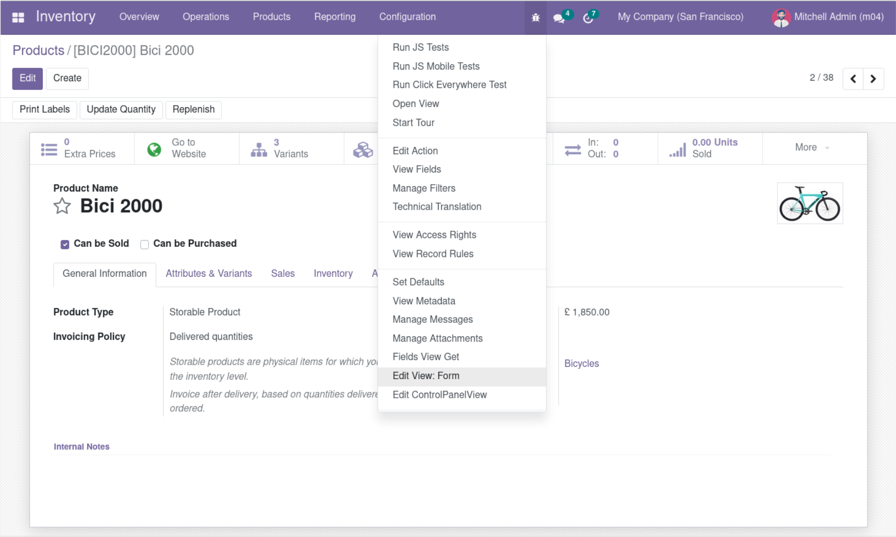 

Com podem veure els detalls són els següents:

* View Name: **product.template.product.form**  
* Model: **product.template**  
* Inheritance View: **product.template.common.form**

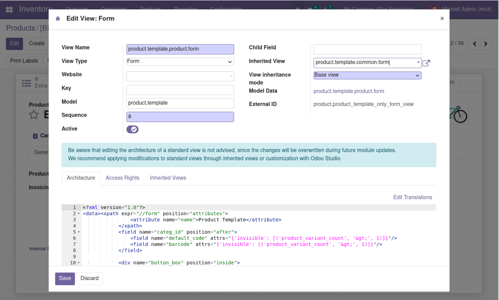 

La vista del formulari de producte hereta de la vista "**product.template.common.form**", per tant, haurem de modificar aquesta vista heretada.

Podem anar directament a aquesta vista heretada, fent clic a la fletxa que hi ha al costat del nom, ens portarà directament a aquesta vista:

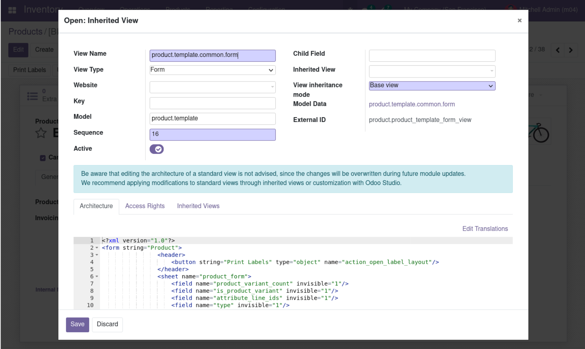 

La vista "**product.template.common.form**", és la vista que s'ha de modificar, en realitat s'ha de modificar l'XML i afegir un camp nou.

* Inspeccionem l'XML per saber on situar el nostre nou camp, en aquest cas, el situem dins de la "**General Information**".  
* Afegim el nou camp `<field name="x_material"/>`

**ADJUNTAR CAPTURA DE PANTALLA**

Mostra els detalls del fitxer XML.

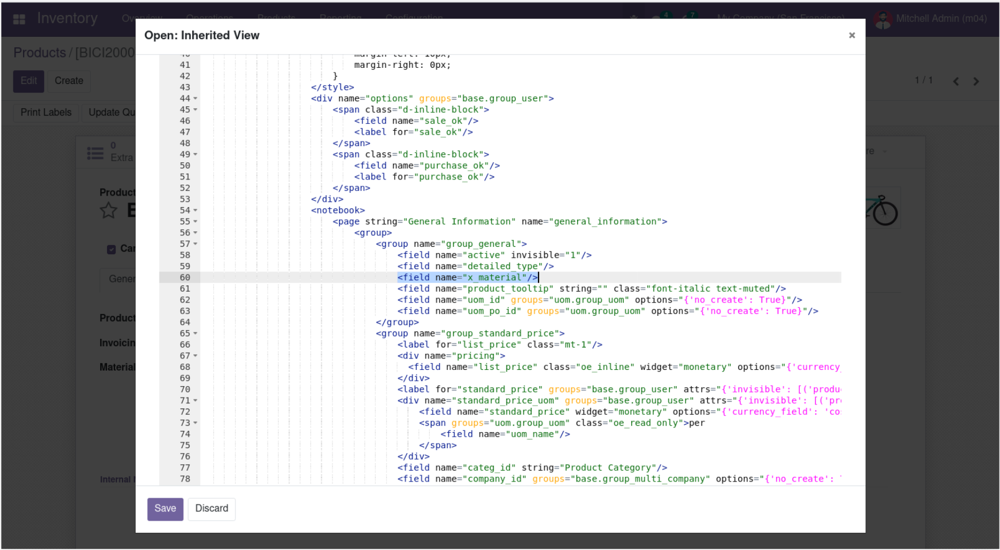 

**Refrescar**

Per comprovar els canvis, refrescar la pàgina de producte.

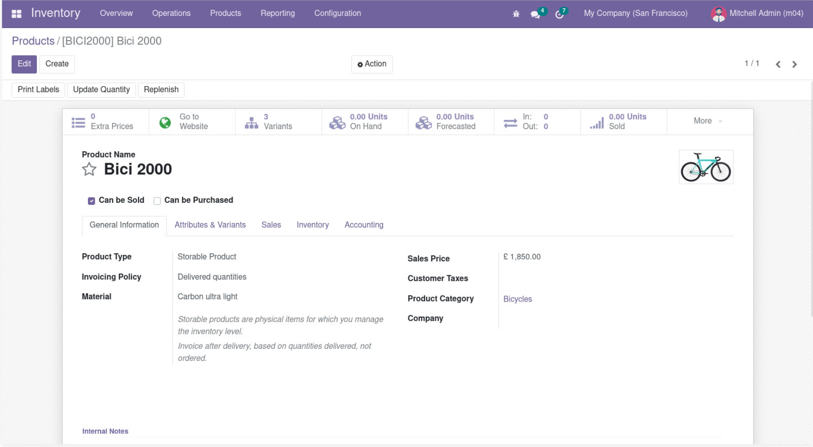 

**ADJUNTAR CAPTURA DE PANTALLA**

Mostra el formulari de producte.

## 5. Technical

Alternativament, es pot accedir a aquestes vistes i formularis, des del mòdul de "**Settings**", l'opció "**Technical**".

**Technical**

La secció **Technical** està habilitada si s'ha activat el mode de desenvolupador.

### 5.1 Camps de la Base de Dades

Aquí es pot buscar la llista de camps de la base de dades com hem fet anteriorment al pas 3:

`Settings > Technical > Database structure > Fields`

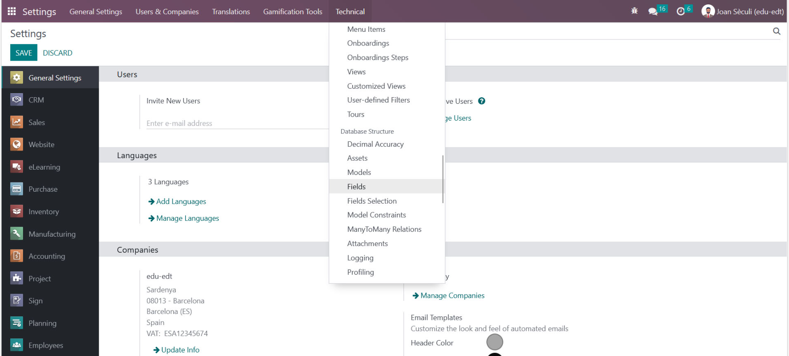 

Ens mostrarà tots els camps:

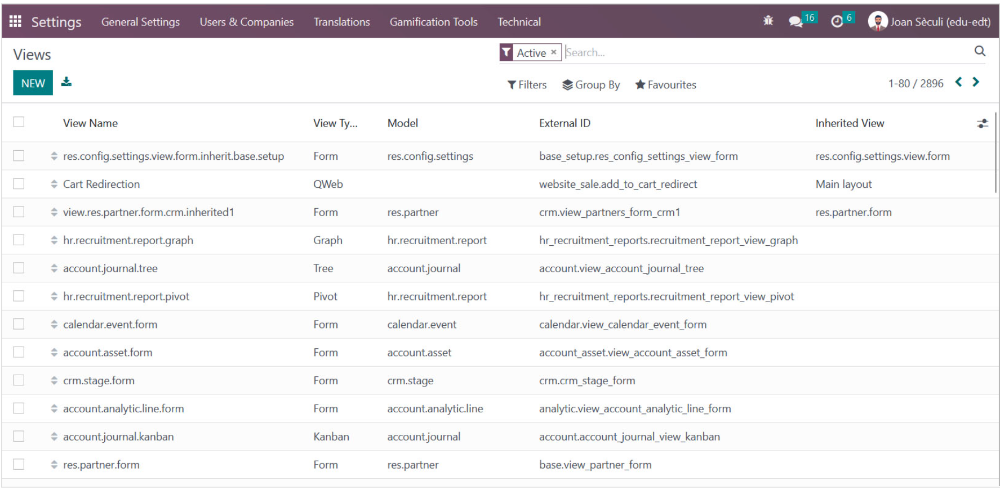 

Aquí podríem crear el nou camp com hem fet abans:

* Associar-lo al model "**Product Template**".  
* Assignar-li un tipus.  
* Afegir-li un text d'ajuda.

### 5.2 Vistes d'usuari

Per accedir a totes les vistes d'usuari de la base de dades:

`Settings > Technical > User interface > Views`

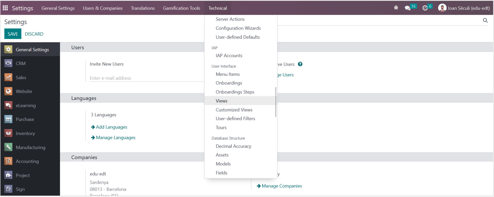 

Aquí podríem també afegir el camp a la vista corresponent com hem fet abans:

* Cercar la vista “**product.template.common.form**”  
* Inspeccionar l'XML per saber on situar el nostre nou camp, en aquest cas, el situem dins de la "**General Information**".  
* Afegir el nou camp `<field name="x_material"/>`

## 6. Comprovem el camp via Postgres

Des de Postgres comproveu que s’ha creat el camp:

`\d product_template` per veure el camp a la BD al PostgreSQL.

**ADJUNTAR CAPTURA DE PANTALLA**

Llistat de PostgreSQL on aparegui el nou camp creat

## 7. Afegir camp al llistat de productes

També podem afegir aquest nou camp a la vista de la llista de productes, modificant directament el model associat:

Mostrem la llista de producte (no el formulari de productes):

`Inventory > Products > Products`

I seleccionem el mode de visualització de llista "**List**" (icones a la dreta de la pàgina).

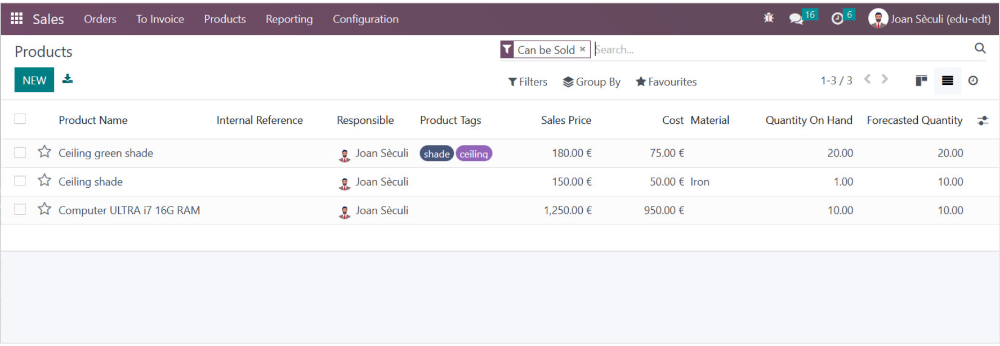 

Des del menú “**Bug**” seleccionem “**Edit View: List**”:

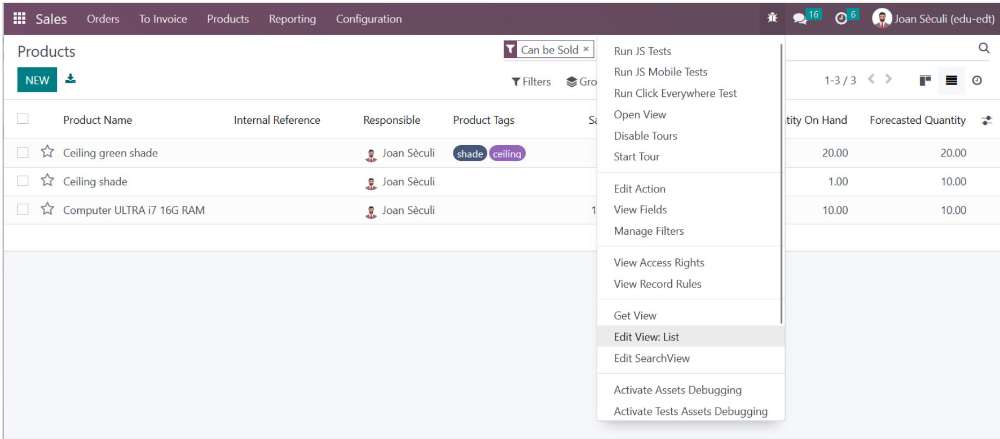 

Editem el fitxer XML afegint el nou camp, com hem fet en el pas 4\.

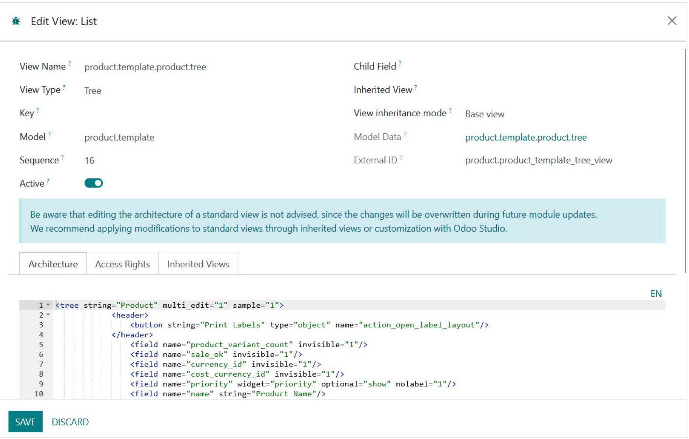 

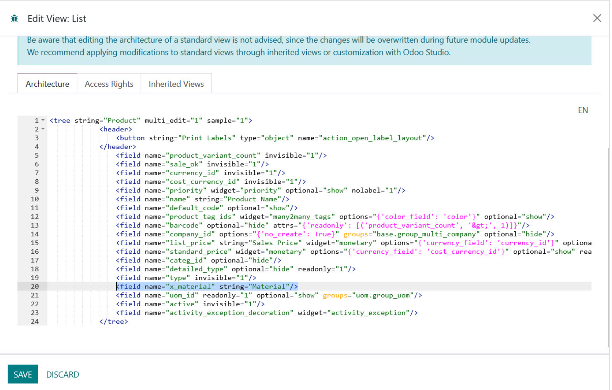 

**ADJUNTAR CAPTURA DE PANTALLA**

Mostra els detalls del fitxer XML.  
Mostra també una captura del formulari de la llista de producte.

## 8. Formulari producte

Es demana afegir els següents camps al formulari de producte com es mostra a la imatge a sota:

| Field | Type | Values |
| :---- | :---- | :---- |
| Material | text |  |
| Fragile | Selection | "Yes", "No" |
| Insurance | Boolean |  |
| HTML | html |  |

Tots han de tenir un text d'ajuda.

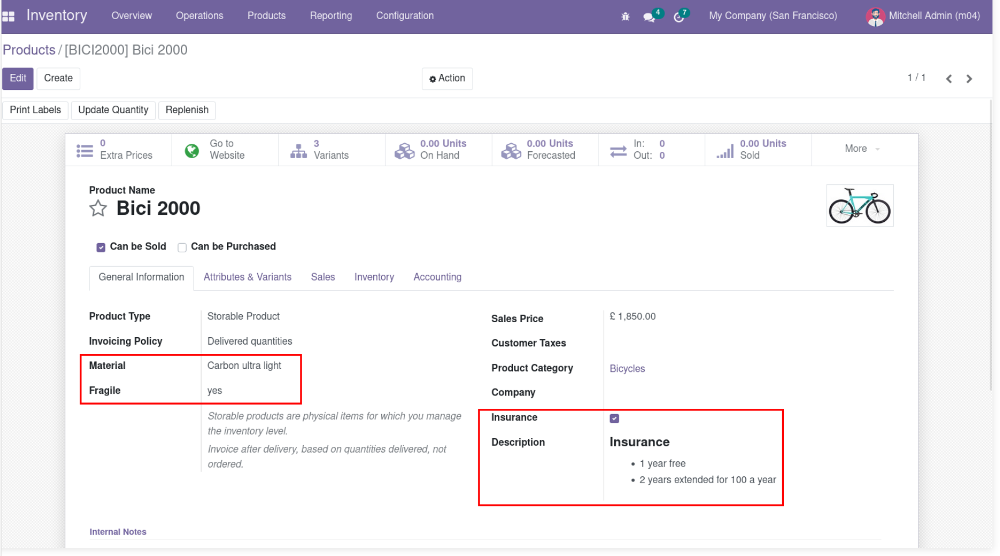 

**ADJUNTAR CAPTURA DE PANTALLA**

Mostra els detalls del fitxer XML.  
Mostra també una captura del formulari de producte.

## 9. Formulari Clients

Es demana afegir els següents camps com es mostra a la imatge de sota:

| Field | Type |
| :---- | :---- |
| Number Employees | integer |
| Incorporation Date | date |

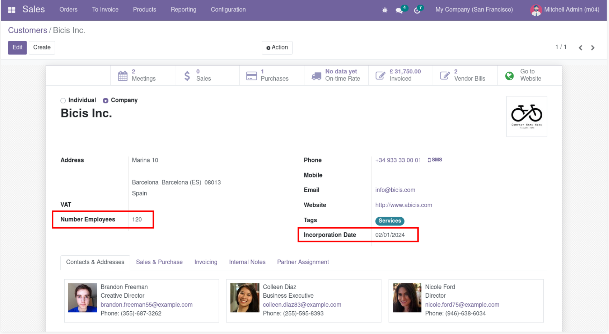 

**ADJUNTAR CAPTURA DE PANTALLA**

Mostra els detalls del fitxer XML.  
Mostra també una captura del formulari de clients.
