# Activitat 5.2

## MÒDUL: Desenvolupament d'aplicacions multiplataforma

RA5:  Desenvolupa components per a un sistema ERP-CRM analitzant i utilitzant el llenguatge de programació incorporat.

## RECURSOS

 - Teoria RA5

## CONDICIONS DE TREBALL

 - Treball individual.
 - Entregar al Moodle l'enllaç del github.
 - Github:
   - Treballar en el mateix repositori de la **RA1**.
   - Crear una branca (al terminal) de nom **ra5** i ubicar-se a la branca (**git checkout ra5**).
   - Al acabar l'activitat, fusionar la branca **ra5** a la branca **main** del github.    

## AVALUACIÓ

 - Activitat avaluable amb nota de 0 a 100.
 - Entregar l'activitat a la data indicada.
 - Treballar a la branca **ra5**.
 - Entregar en format **.md** (markdown) amb la mateixa nomenclatura que el de l'activitat actual.

## ENUNCIAT 

**Invers i On SL Asesoria Financera** volen fer servir Odoo i necessiten un mòdul personalitzat per poder portar l'assessorament dels seus clients.

Necessiten els següents camps:

* Contacte / Client \-\> **Camp tipus Many2One**  
* Perfil de risc (Conservador, Moderat, Agressiu) \-\> **Camp tipus Desplegable**  
* Secció “Informació Financera”  
  * Patrimoni (€) \-\> **Camp tipus Float**  
  * Aportació (€) \-\> **Camp tipus Float**  
  * Altres actius \-\> **Camp tipus Text**  
  * Deutes \-\> **Camp tipus Text**  
* Secció “Descripció”  
  * Descripció personal \-\> **Camp tipus Text**  
* Secció “Sessions (Llista de sessions)”  
  * Data \-\> **Camp tipus Date**  
  * Assumpte \-\> **Camp tipus Text**  
  * Contingut de la Sessió \-\> **Camp tipus Text**

# Passos previs d’integració

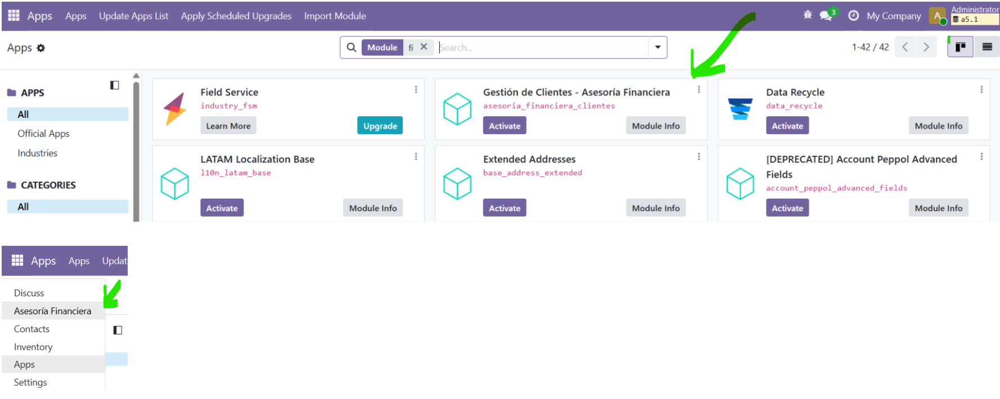<br>

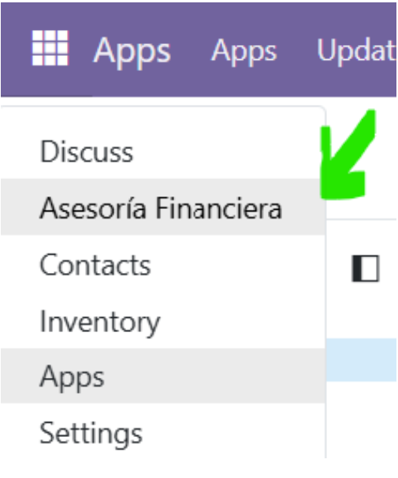<br>

# Com seria la vista

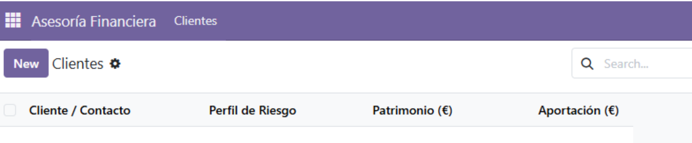<br>

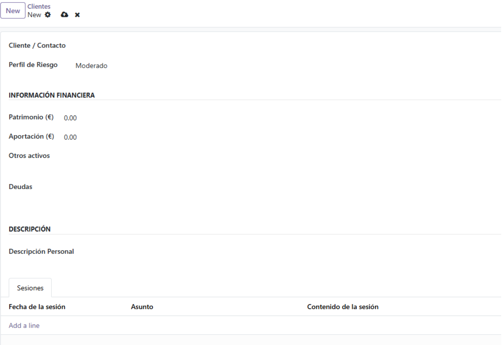<br>

# Permisos i camps

* El camp “Client / Contacte” ha d'estar vinculat a contactes per poder assignar-li un client / contacte. Podem crear-lo al vol o seleccionar contactes ja creats.   
* Recordeu de donar-vos permisos a Usuaris \> Administrador \> Contactes \> Crear i a dalt, al botó **Access Rights** de donar-vos permisos de creació a Res\_partner

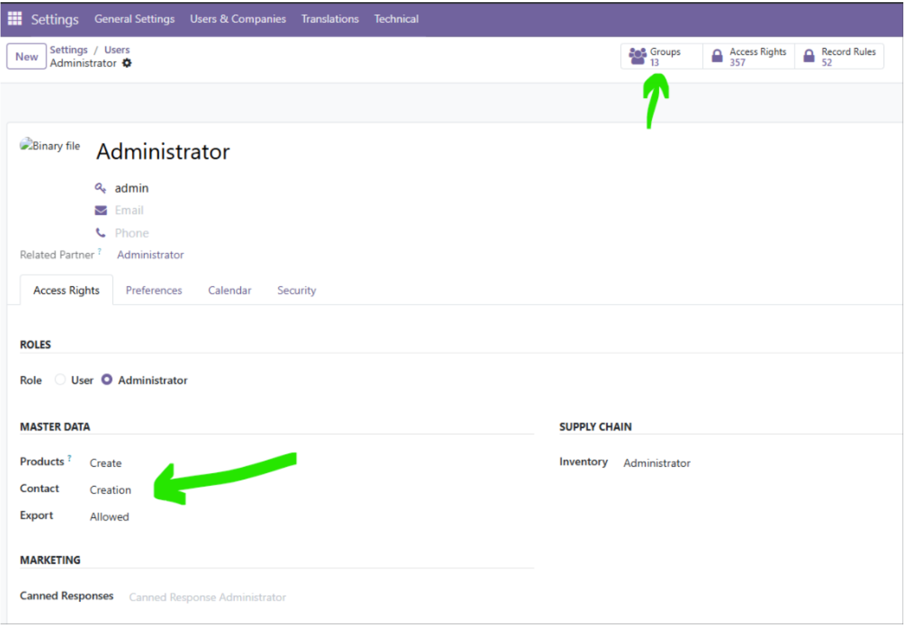<br>

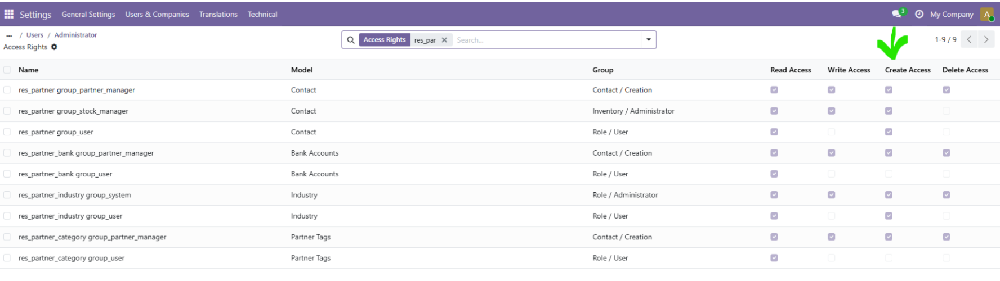<br>

* Y ya podrem accedir a contactes

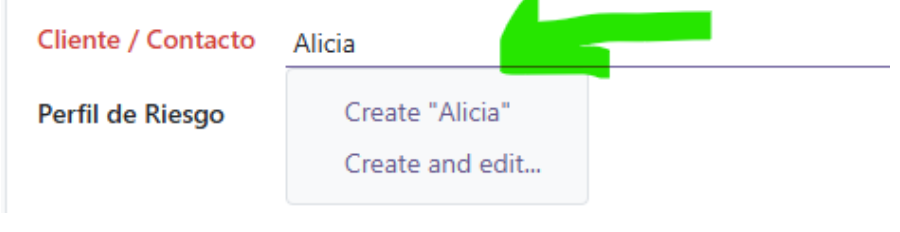<br>

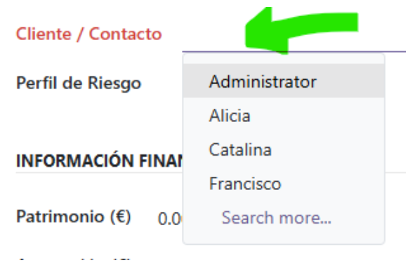<br>

* El campo perfil de riesgo tiene que tener un desplegable con los diferentes perfiles de inversor

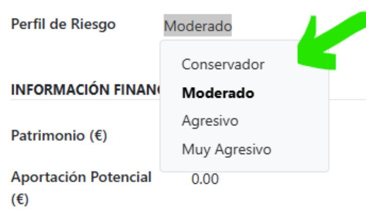<br>

* Sección Finanzas

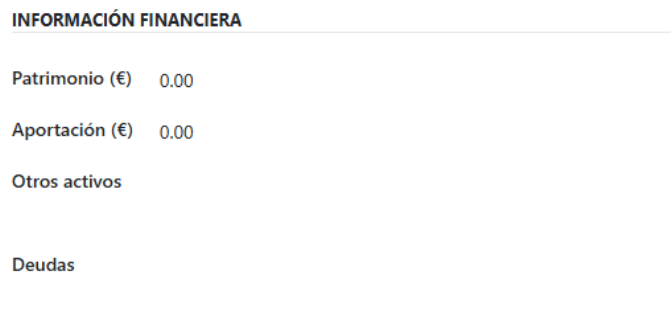<br>

* Descripció personal

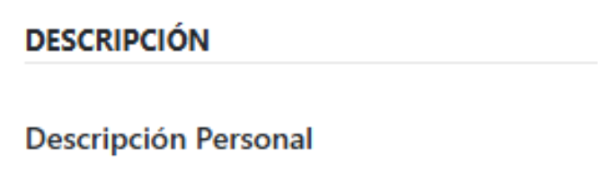<br>

* Secció amb les sessions del client

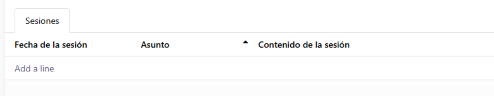<br>

* Vista cliente:

```xml
<odoo>
    <!-- ACCIÓN: Define una acción de ventana para abrir el modelo 'asesoria.cliente' -->
    <record id="action_asesoria_clientes" model="ir.actions.act_window">
        <!-- Nombre que verá el usuario en la acción -->
        <field name="name">Clientes</field>
        <!-- Modelo que se abrirá al ejecutar la acción -->
        <field name="res_model">asesoria.cliente</field>
        <!-- Modos de vista disponibles: lista y formulario -->
        <field name="view_mode">list,form</field>
    </record>
    <!-- MENÚ PRINCIPAL: Crea el menú raíz "Asesoría Financiera" -->
    <menuitem id="menu_asesoria_root" name="Asesoría Financiera"/>
    <!-- SUBMENÚ: Crea el menú "Clientes" dentro del menú raíz y lo vincula a la acción -->
    <menuitem id="menu_asesoria_clientes"
              name="Clientes"
              parent="menu_asesoria_root"
              action="action_asesoria_clientes"/>
    <!-- VISTA FORMULARIO: Define cómo se verá el formulario del modelo 'asesoria.cliente' -->
    <record id="view_asesoria_cliente_form" model="ir.ui.view">
        <!-- Nombre interno de la vista -->
        <field name="name">asesoria.cliente.form</field>
        <!-- Modelo al que pertenece la vista -->
        <field name="model">asesoria.cliente</field>
        <!-- Estructura XML de la vista -->
        <field name="arch" type="xml">
            <form string="Cliente Financiero">
                <sheet>
                    <!-- Primer grupo: datos básicos -->
                    <group>
                        <!-- Campo Many2one hacia contacto -->
                        <field name="contacto_id"/>
                        <!-- Campo selección o similar para riesgo -->
                        <field name="perfil_riesgo"/>
                    </group>
                    <!-- Segundo grupo: información financiera -->
                    <group string="Información Financiera">
                        <field name="patrimonio"/>
                        <field name="aportacion"/>
                        <field name="posiciones"/>
                        <field name="deudas"/>
                    </group>
                    <!-- Tercer grupo: descripción libre -->
                    <group string="Descripción">
                        <field name="descripcion"/>
                    </group>
                    <!-- Notebook: pestañas adicionales -->
                    <notebook>
                        <!-- Página para las sesiones -->
                        <page string="Sesiones">
                            <!-- Campo One2many hacia sesiones -->
                            <field name="sesion_ids">
                                <!-- Vista tipo lista editable desde abajo,
                                La edición se hace en línea,
                                sin abrir un formulario emergente.-->
                                <list editable="bottom">
                                    <field name="fecha"/>
                                    <field name="asunto"/>
                                    <field name="contenido"/>
                                </list>
                                <!-- Vista formulario para cada línea del One2many -->
                                <form>
                                    <group>
                                        <field name="fecha"/>
                                        <field name="asunto"/>
                                        <field name="contenido"/>
                                    </group>
                                </form>
                            </field>
                        </page>
                    </notebook>
                </sheet>
            </form>
        </field>
    </record>

    <!-- VISTA LISTA: Define la vista tipo lista del modelo 'asesoria.cliente' -->
    <record id="view_asesoria_cliente_list" model="ir.ui.view">
        <!-- Nombre interno de la vista -->
        <field name="name">asesoria.cliente.list</field>
        <!-- Modelo al que pertenece -->
        <field name="model">asesoria.cliente</field>
        <!-- Estructura XML de la vista -->
        <field name="arch" type="xml">
            <list>
                <!-- Columnas que se mostrarán en la lista -->
                <field name="contacto_id"/>
                <field name="perfil_riesgo"/>
                <field name="patrimonio"/>
                <field name="aportacion"/>
            </list>
        </field>
    </record>
</odoo>

```


* vista sesion:

```xml
<odoo>
    <!-- Registro de una vista: define una vista personalizada para el modelo 'asesoria.sesion' -->
    <record id="view_asesoria_sesion_form" model="ir.ui.view">
        <!-- Nombre interno de la vista -->
        <field name="name">asesoria.sesion.form</field>
        <!-- Modelo al que pertenece esta vista -->
        <field name="model">asesoria.sesion</field>
        <!-- Aquí empieza la definición XML de la vista -->
        <field name="arch" type="xml">
            <!-- Vista tipo formulario -->
            <form string="Sesión de Asesoría">
                <!-- Contenedor principal del formulario -->
                <sheet>
                    <!-- Grupo de campos: organiza los inputs en una columna -->
                    <group>
                        <!-- Campo Many2one: cliente asociado a la sesión -->
                        <field name="cliente_id"/>
                        <!-- Campo Date: fecha de la sesión -->
                        <field name="fecha"/>
                        <!-- Campo Char: asunto o título de la sesión -->
                        <field name="asunto"/>
                        <!-- Campo Text: contenido o notas de la sesión -->
                        <field name="contenido"/>
                    </group>
                </sheet>
            </form>
        </field>
    </record>
</odoo>

```

**IMPORTANTE:** Os harán falta dos clases. Clase cliente.py y sesion.py

