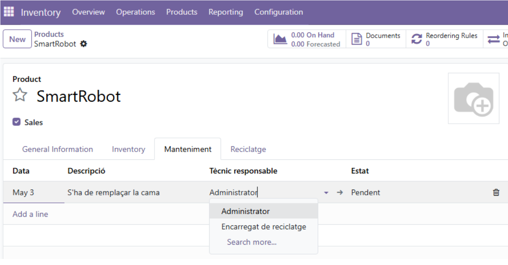
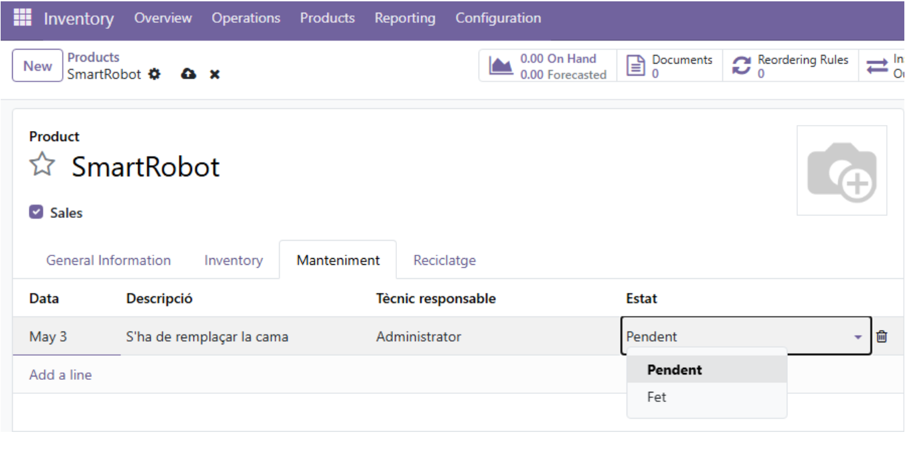
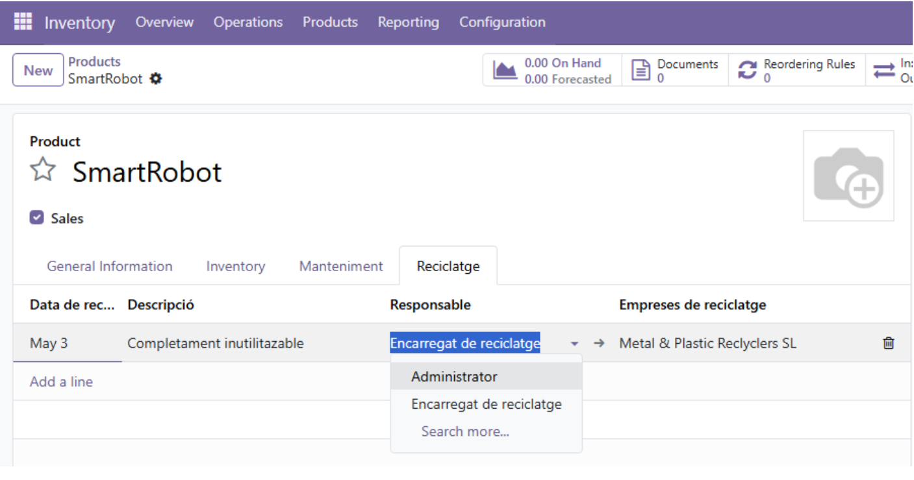
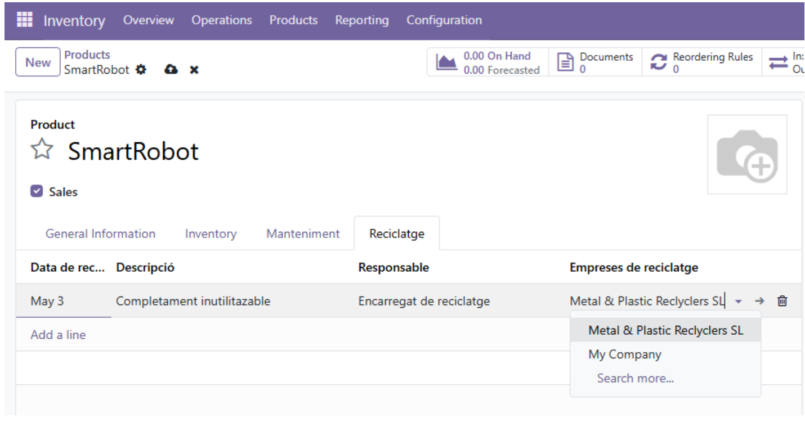

# Activitat 5.3

## MÒDUL: Desenvolupament d'aplicacions multiplataforma

RA5:  Desenvolupa components per a un sistema ERP-CRM analitzant i utilitzant el llenguatge de programació incorporat.

## RECURSOS

 - Teoria RA5

## CONDICIONS DE TREBALL

 - Treball individual.
 - Entregar al Moodle l'enllaç del github.
 - Github:
   - Treballar en el mateix repositori de la **RA1**.
   - Crear una branca (al terminal) de nom **ra5** i ubicar-se a la branca (**git checkout ra5**).
   - Al acabar l'activitat, fusionar la branca **ra5** a la branca **main** del github.    

## AVALUACIÓ

 - Activitat avaluable amb nota de 0 a 100.
 - Entregar l'activitat a la data indicada.
 - Treballar a la branca **ra5**.
 - Entregar en format **.md** (markdown) amb la mateixa nomenclatura que el de l'activitat actual.

## ENUNCIAT 

Cybertech necessita afegir dues seccions als seus robots que tenen com a producte en el seu inventari.

La secció de **Manteniment** i la secció de **Reciclatge**.

De tal forma que quedi així:

**Secció Manteniment:**

 

 

**Secció Recyclatge:**

 

 

Dintre de la carpeta 5.3_moduls hi tindreu accés al mòdul però sense les classes. Els models / classes ho heu de desenvolupar vosaltres.

Primer haureu d’instal.lar Inventari i Contactes. Enrecordeu-vos!

