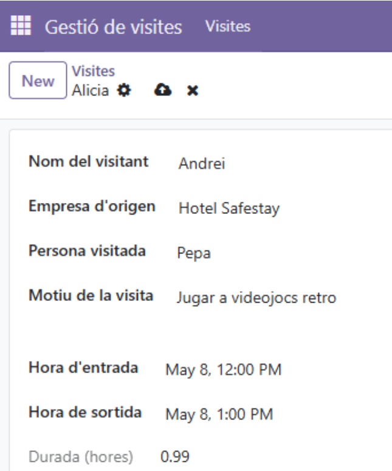

# Activitat 5.4

## MÒDUL: Desenvolupament d'aplicacions multiplataforma

RA5:  Desenvolupa components per a un sistema ERP-CRM analitzant i utilitzant el llenguatge de programació incorporat.

## RECURSOS

 - Teoria RA5

## CONDICIONS DE TREBALL

 - Treball individual.
 - Entregar al Moodle l'enllaç del github.
 - Github:
   - Treballar en el mateix repositori de la **RA1**.
   - Crear una branca (al terminal) de nom **ra5** i ubicar-se a la branca (**git checkout ra5**).
   - Al acabar l'activitat, fusionar la branca **ra5** a la branca **main** del github.    

## AVALUACIÓ

 - Activitat avaluable amb nota de 0 a 100.
 - Entregar l'activitat a la data indicada.
 - Treballar a la branca **ra5**.
 - Entregar en format **.md** (markdown) amb la mateixa nomenclatura que el de l'activitat actual.

## ENUNCIAT 

A la fira de videojocs **SAGA Barcelona Game Fest** necessiten un gestor de visites on s’inclogui:

* Nom del visitant  
* Empresa origen  
* Motiu de la visita  
* Hora d’entrada  
* Hora de sortida  
* Durada de la seva estada

<br>

Función necesaria:

```py
  @api.depends("check_in", "check_out")
    def _compute_duration(self):
        for record in self:
            if record.check_in and record.check_out:
                delta = record.check_out - record.check_in
                record.duration = delta.total_seconds() / 3600.0
            else:
                record.duration = 0.0
```

Vista:

```xml
<?xml version="1.0" encoding="UTF-8"?>
<odoo>
    <!-- Acció i menú principal -->
    <record id="action_visit_management" model="ir.actions.act_window">
        <field name="name">Visites</field>
        <field name="res_model">visit.management</field>
        <field name="view_mode">list,form</field>
        <field name="help" type="html">
            <p>
                Registreu aquí les visites que arriben a l'empresa.
            </p>
        </field>
    </record>
    <menuitem id="menu_visit_root"
              name="Gestió de visites"
              sequence="10"/>
    <menuitem id="menu_visit_management"
              name="Visites"
              parent="menu_visit_root"
              action="action_visit_management"
              sequence="10"/>
    <!-- Vista llista -->
    <record id="view_visit_management_list" model="ir.ui.view">
        <field name="name">visit.management.list</field>
        <field name="model">visit.management</field>
        <field name="arch" type="xml">
            <list string="Visites">
                <field name="name"/>
                <field name="company"/>
                <field name="contact_person"/>
                <field name="check_in"/>
                <field name="check_out"/>
                <field name="duration"/>
            </list>
        </field>
    </record>
    <!-- Vista formulari -->
    <record id="view_visit_management_form" model="ir.ui.view">
        <field name="name">visit.management.form</field>
        <field name="model">visit.management</field>
        <field name="arch" type="xml">
            <form string="Visita">
                <sheet>
                    <group>
                        <field name="name"/>
                        <field name="company"/>
                    </group>
                    <group>
                        <field name="contact_person"/>
                        <field name="reason"/>
                    </group>
                    <group>
                        <field name="check_in"/>
                        <field name="check_out"/>
                        <field name="duration" readonly="1"/>
                    </group>
                </sheet>
            </form>
        </field>
    </record>
</odoo>
```
