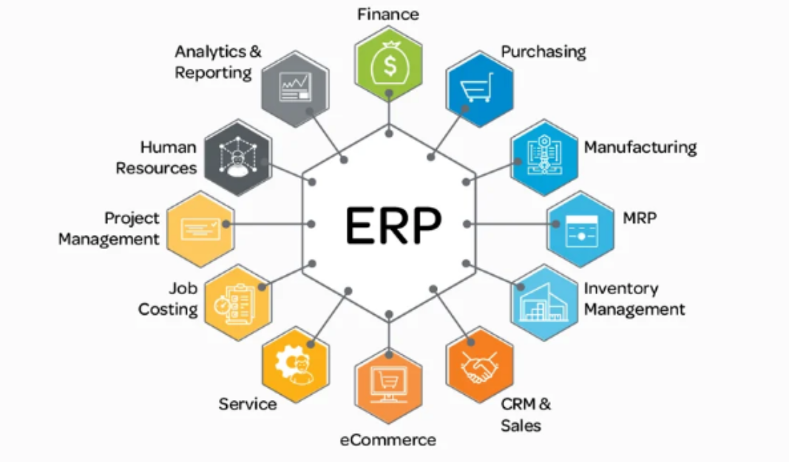
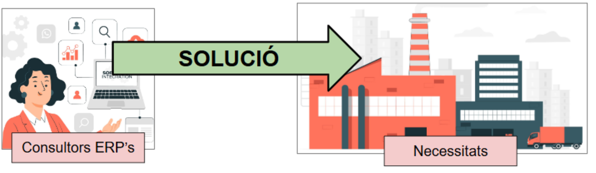
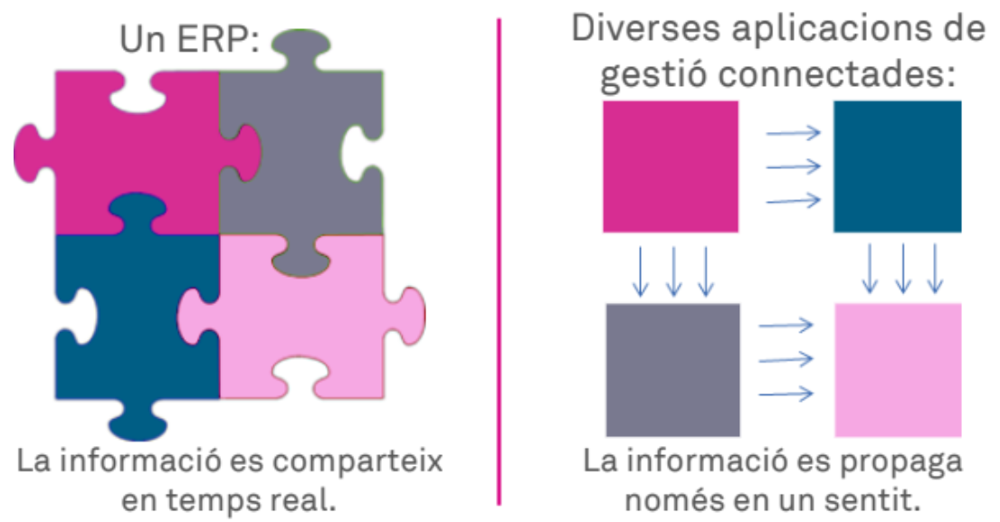
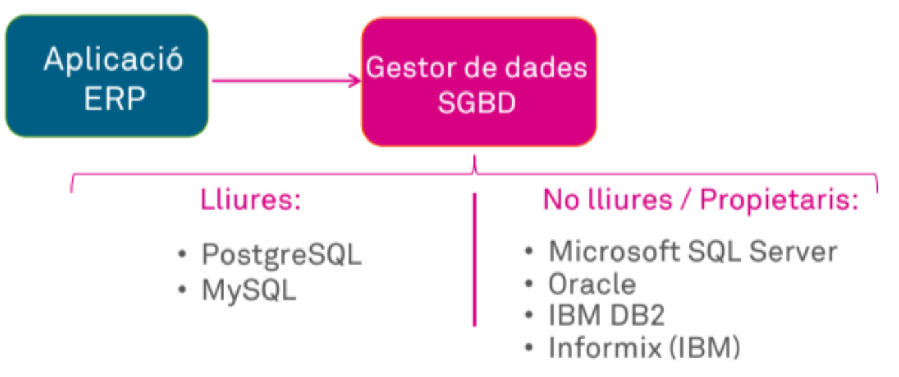
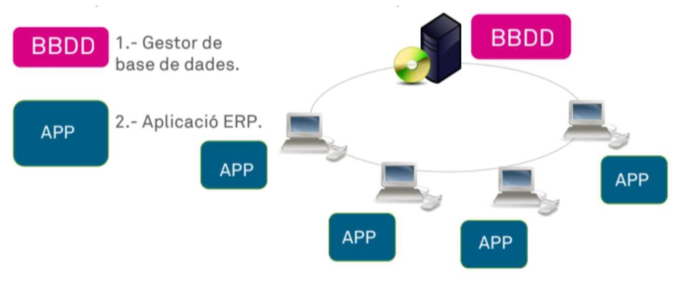
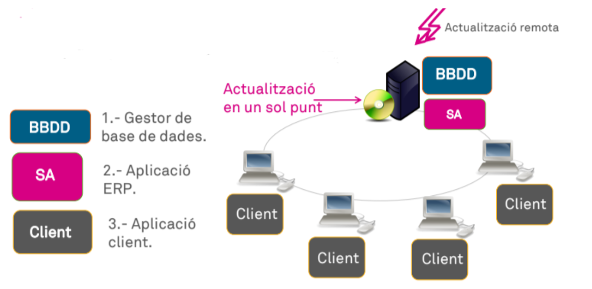
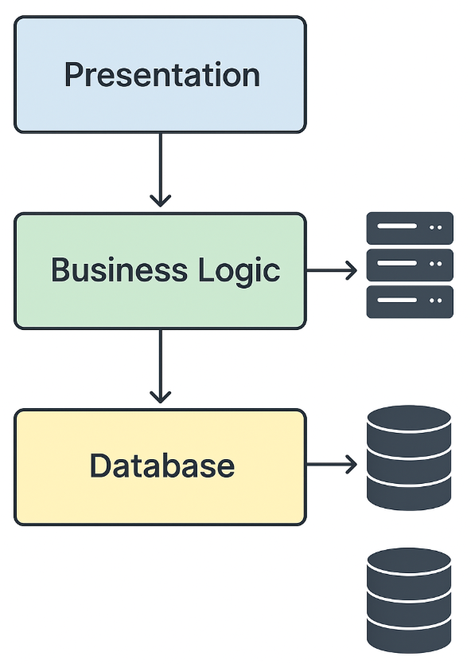
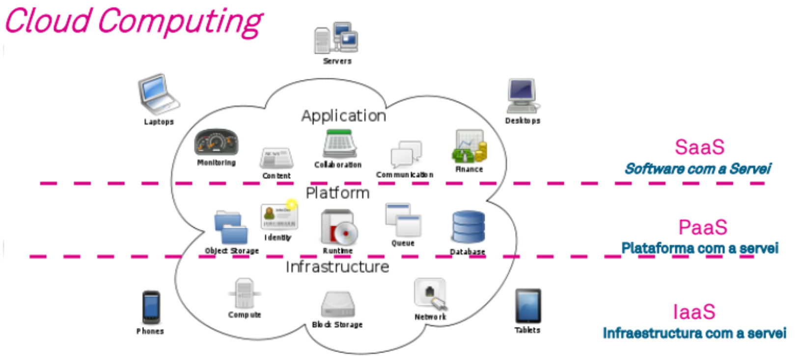
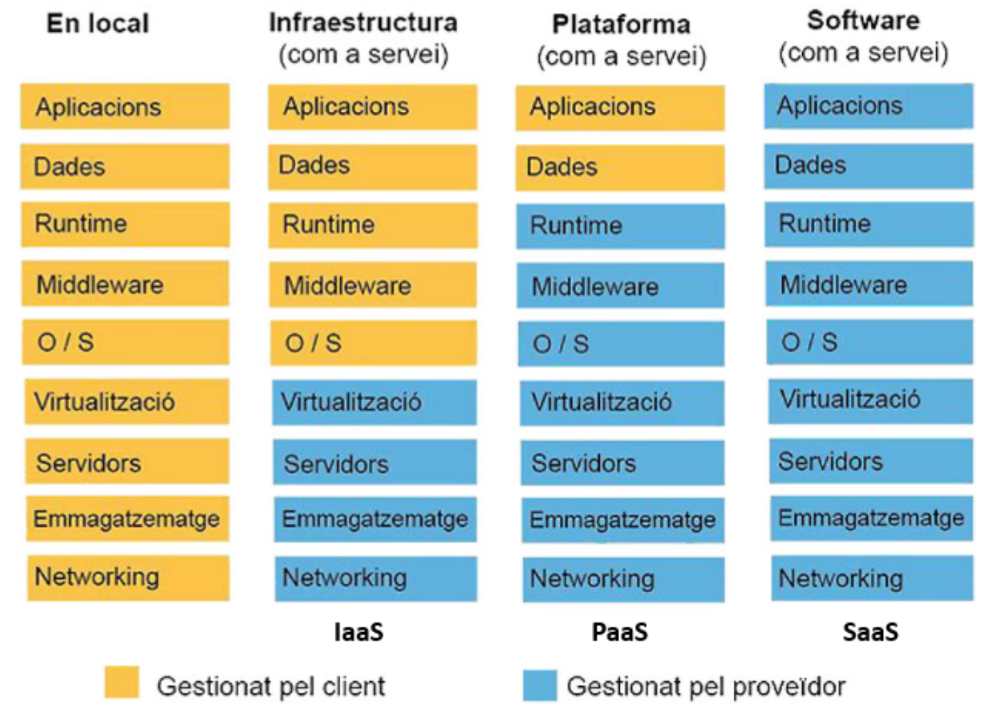

# **SGE**

## Sistemes de Gestió d’Empreses

# **Què és una empresa?**

Una empresa és una organització amb personalitat jurídica que pretén generar riquesa i ocupació, a través de l'elaboració o comercialització d'un producte o servei que satisfaci les necessitats i demandes de la societat.

# **Classificació de les empreses**

Segons el sector de l’activitat

* **Primari**: empreses que exploten recursos naturals (agricultura, pesca, mineria).  
* **Secundari**: empreses que transformen matèries primeres en productes (indústria, construcció).  
* **Terciari**: empreses de serveis (comerç, transport, educació, turisme, finances).

Segons el tamany

* **Microempreses**: menys de 10 treballadors.  
* **Petites**: entre 10 i 49 treballadors.  
* **Mitjanes**: entre 50 i 249 treballadors.  
* **Grans**: més de 250 treballadors.

Segons la propietat del capital

* **Privada**: capital aportat per particulars o empreses privades.  
* **Pública**: capital aportat per l’Estat o administracions públiques.  
* **Mixta**: combinació de capital públic i privat.

Segons l’àmbit d’activitat

* **Locals**: operen dins d’una ciutat o municipi.  
* **Provincials/Regionals**: actuen en una província o comunitat autònoma.  
* **Nacionals**: cobreixen tot el territori d’un país.  
* **Internacionals**: operen en diversos països.

Segons el destí dels beneficis

* **Amb ànim de lucre**: busquen obtenir guanys econòmics per als propietaris o accionistes.  
* **Sense ànim de lucre**: destinen els recursos a finalitats socials, culturals o comunitàries (ONG...).

Segons la forma jurídica

* **Unipersonal**: propietari únic que assumeix responsabilitat i beneficis.  
* **Societat col·lectiva**: diversos socis amb responsabilitat compartida i il·limitada.  
* **Cooperativa**: associació de persones que gestionen democràticament i reparteixen beneficis segons la participació.  
* **Societat anònima (SA)**: capital dividit en accions, responsabilitat limitada al capital aportat.  
* **Societat limitada (SL)**: capital dividit en participacions, responsabilitat limitada.  
* Altres formes: societats laborals, comanditàries, etc.

# **Tamanys d’una empresa**

Per classificar una empresa, es consideren els tres criteris: nombre de treballadors, volum de negoci i balanç.

Si una empresa supera els límits en dos dels tres criteris, s’assigna al tamany superior.  
Aquesta classificació és important per accedir a ajudes, complir obligacions legals i participar en concursos públics.

* Microempresa: fins a 10 treballadors, amb un volum de negoci o balanç anual que no supera els 2 milions d’euros.  
* Petita empresa: fins a 50 treballadors, amb un màxim de 10 milions d’euros en volum de negoci o balanç.  
* Mitjana empresa: fins a 250 treballadors, amb un volum de negoci de fins a 50 milions d’euros o un balanç de fins a 43 milions.  
* Gran empresa: més de 250 treballadors, amb més de 50 milions d’euros en negoci o més de 43 milions en balanç.

# **Models de negoci**

|Model|Significat|Relació|Exemple típic|
|:-----|:-----|:-----|:-----|
|B2B (Business-to-Business)|Transaccions entre empreses|Empresa → Empresa|SAAP venent software a altres empreses|
|B2C (Business-to-Consumer)|Transaccions amb particulars|Empresa → particular|Amazon, Zara venent producte a consumidors|
|B2G (Business-to-Government)|Contractes amb administracions|Empresa → Administracions públiques|Indra venent solucions tecnològiques a l'estat|
|C2C (Consumer-to-Consumer)|Transaccions entre particulars|Particular → Particular|Wallapop, eBay|
|C2B (Consumer to Business)| Creació de valor, producte o servei per les empreses |Persona → Empresa|Influencers oferint contingut a marques|
|G2C (Government to Consumer)| Relació i comunicació entre ciutadans i administració |Govern → Ciutadà|Agèncie tributaria oferint servei online|
|G2B (Government to Bussines)| Servei i transaccions digitals entre el govern i les empreses |Govern → Empresa|Subvencions o licitacions públiques|

# **Què és un software empresarial?**

El software empresarial és el conjunt de programes que una empresa utilitza per acompanyar la seva gestió diària.

* Finances  
* RRHH  
* Subministres  
* Fabricació

# **Tipus de Software empresarial**

Una classificació segons com estan creats:

* Aplicacions genèriques  
* Programari a mida  
* Programari estàndard  
* Sistemes operacionals ERP

## 

## **Aplicacions genèriques**

Aplicacions que no estan desenvolupades específicament per a la gestió de l’empresa sinó que són de caràcter més general, com aplicacions ofimàtiques, navegadors web o programes de correu.

Normalment, són aplicacions destinades a petites empreses.

## **Programari a mida**

El programari a mida consisteix a desenvolupar un nou programa informàtic que permeti informatitzar l’activitat de l’empresa.

Aquests programes s’adapten perfectament a les seves necessitats.

Presenta els següents inconvenients:

* S'ha d'analitzar en detall el funcionament de l'empresa.  
* La implementació és un procés llarg i propens a errors, ja que el programa no s'ha provat mai.  
* Qualsevol canvi implica fer canvis en el programari, i els costos poden ser elevats.

## **Programari estàndard**

El programari estàndard de gestió d’empreses és un programari desenvolupat específicament per poder funcionar en la majoria d’organitzacions.

Donen solució a tasques concretes en una empresa genèrica global o d’un sector concret.

La idea és oferir un paquet que faci les funcions tan genèricament com sigui possible perquè es pugui usar en diferents empreses.

* Abaratir molt els costos perquè el programari ja està desenvolupat i provat.  
* Reduir el temps d’implantació del programari.

Els seus inconvenients són:

* Les funcions són molts generals perquè funcionin a qualsevol lloc, per tant, no solen adaptar-se perfectament a les especificitats de cap empresa.  
* Poden provocar que sigui l’empresa la que s’hagi d’adaptar al funcionament del programa i no al revés.  
* Les empreses que utilitzen diferents programaris estàndards per cada un dels departaments, no poden intercanviar informació perquè els sistemes són incompatibles entre ells.

# **ERP (Enterprise Resource Planning)**

 

Els sistemes ERP integren totes les dades i processos de l’empresa en una única plataforma.

Un ERP pot ser integrat tant en local o en servidor. 

 

Aporten funcionalitats a les empreses, amb un sistema d'emmagatzemament únic.

Els sistemes ERP, Enterprise Resource Planning o Sistema de Planificació de Recursos Empresarials, engloben totes les dades i processos d’una organització en un sistema integrat.

Els ERP són sistemes d'informació que integren i manipulen les activitats d'una empresa, ajuden a prendre decisions i mantenir informació actualitzada.

Està compost de diferents mòduls (vendes, producció, logística, comptabilitat, inventaris, comandes, nòmines, etc.) que comparteixen un mateix gestor de base de dades.

 

# **Implantació d’un ERP**

## **Estudi de l’empresa**

És molt important fer un estudi previ de l’empresa per veure si escau i fer una correcta instal.lació.

## **Reptes al implementar un ERP**

* **Problemes tècnics:** Problemes en la implementació a nivell de software, hardware, infraestructura de red, etc.  
* **Problemes relacionats amb les dades:** Problemes en la migració de dades ja existents, dades incompletes, errors d’organització de dades, etc.  
* **Problemes amb la mentalitat de l’empresa:** És possible que certs departaments de l’empresa no vegin les avantatges de la implantació d’un ERP.  
* **Treballadors:**  
- És possible trobar-se amb treballadors que estiguin en contra de la implementació de noves tecnologies volen mantenir les antigues o inclús, en paper.  
- No donar formació als treballadors.  
- Por a perdre el lloc de treball.

## **Mòduls d'un ERP**

Mòduls més comuns d'un ERP:

* Inventari y logística  
* Producció  
* Projectes  
* Vendes  
* Compres  
* Gestió d'estocs  
* Gestió de tresoreria  
* Comptabilitat i finances  
* Gestió documental DMS  
* Fabricació  
* Recursos Humans  
* TPV (Terminal punto de venta)  
* CRM (Customer Relationship Management. Gestió de la relació amb el client)  
* MRP (Material Resource Planning relaciona Compres, Vendes, Stock, Producció..)  
* Tasques de reporting i intel·ligència del negoci BI  
* Anàlisi de competidors

## **Avantatges i inconvenients dels ERP**

**Avantatges:**

* Una única instal.lació i manteniment  
* El funcionament modular s’adapta a diferents tipus d'empreses i sectors, i qualsevol empresa pot adaptar el programa als canvis i a les necessitats de cada moment, integrant-hi o eliminant-ne mòduls segons les noves necessitats.  
* Instal.lació de nous mòduls  
* Permet adaptar mòduls concrets mitjançant eines de desenvolupament.  
* Simplifica les comunicacions entre processos.  
* Permeten treballar amb el navegador web.  
* Temps d'aprenentatge es redueix, ja que no cal aprendre com funcionen diferents entorns.  
* Ús compartit del mateix sistema d'informació que facilita la comunicació interna i externa.  
* Augment de la productivitat (si es fa "bé") i minimitza errors humans.  
* Permet prendre millors decisions empresarials. Es disposa de tota la informació en tot moment, en temps real i amb integritat de les dades.

**Inconvenients:**

* La implantació sol ser complexa, ja que cal que hi intervingui i s’hi impliqui tota l'empresa.  
* Pot ser que la manera de fer d'algun departament s'hagi de canviar per adaptar-se a la manera de fer de l'ERP.  
* Els costos d'adquisició del software.  
* La corba d'aprenentatge per alguns treballadors pot ser elevada.  
* Un ciberatac pot deixar tota la info exposada.  
* Possible sobredimensionament

# **Revisió dels ERP actuals al mercat**

Alguns dels sistemes ERP més utilitzats actualment són:

* **SAP S/4HANA / SAP Business One** (SAP SE): ERP propietari, orientat a grans empreses (S/4HANA) i PIMES (Business One).  
* **Microsoft Dynamics 365** (Microsoft): ERP propietari en format subscripció SaaS, molt integrat amb l’ecosistema Microsoft (Office 365, Teams, Power BI).  
* **Odoo** (Odoo S.A.): ERP modular amb versió Community (codi obert, gratuïta) i versió Enterprise (propietària, per subscripció). Molt utilitzat en PIMES.  
* **Oracle NetSuite** (Oracle): ERP natiu al núvol (SaaS), orientat a PIMES i empreses mitjanes.  
* **Sage 200/X3** (Sage Group): ERP propietari orientat principalment a PIMES.  
* **Openbravo** (Openbravo): ERP de codi obert/propietari especialitzat en retail i distribució.

# **Tipologies funcionals d’un ERP**

## **Vertical**

Un ERP vertical està **especialitzat en un sector concret**. Està dissenyat per cobrir les necessitats específiques d’una indústria o activitat.

L'avantatge d'aquests sistemes és que són solucions específiques per a un tipus de negoci en concret i estan preparades per cobrir només les necessitats d'aquestes companyies. Per tant, el seu desplegament és molt més ràpid.

**Característiques:**

* Funcionalitats adaptades a processos sectorials (ex: traçabilitat alimentària, gestió clínica, producció farmacèutica).  
* Menys personalització general, però més profunditat funcional en el seu nínxol.  
* Ideal per empreses que operen en sectors regulats o amb processos molt específics.

**Exemples:**

* Un ERP per a hospitals amb mòduls de gestió de pacients, historial mèdic i facturació sanitària.  
* Un ERP per a tallers mecànics amb gestió de peces, ordres de reparació i pressupostos.

## 

## **Horitzontal**

Un ERP horitzontal és **genèric i modular**, pensat per adaptar-se a qualsevol tipus d’empresa, independentment del sector.

* El temps d'implantació es redueix considerablement, ja que els mòduls estan adaptats a les necessitats del negoci.  
* Cost inferior ja que els horitzontals s'han d'adaptar a les necessitats de l'empresa.

**Característiques:**

* Inclou mòduls generals: comptabilitat, vendes, compres, inventari, RRHH, etc.  
* Alta capacitat de personalització i integració.  
* Ideal per empreses que volen una solució flexible i escalable.

**Exemples:**

* SAP Business One, Odoo, Microsoft Dynamics 365: poden adaptar-se a una empresa de serveis, comerç, producció o logística.

# **Arquitectura d’un ERP**

Les aplicacions ERP deleguen la gestió de les dades a un GSBD (sistema de gestió de bases de dades)

 

## **Arquitectura de Dues Capes (Two-Tier)**

És una arquitectura senzilla on el client (usuari) es connecta directament amb el servidor que conté la base de dades i la lògica de negoci.

**Components:**

1. Client: la interfície d’usuari (pot ser una aplicació d’escriptori o web).  
2. Servidor: gestiona la lògica de negoci i accedeix a la base de dades.

**Característiques:**

* Més simple i fàcil d’implementar.  
* Adequada per a petites empreses o entorns amb pocs usuaris.  
* Escalabilitat i flexibilitat limitades.

**Exemple:**

Un ERP instal·lat en els ordinadors dels usuaris que accedeixi directament a una base de dades central per consultar comandes o gestionar inventari.

 

## **Arquitectura de Tres Capes (Three-Tier)**

Divideix el sistema en tres nivells independents, millorant la modularitat, la seguretat i la capacitat d’escalat.

**Components:**

1. **Capa de presentació**: interfície d’usuari (web, mòbil, etc.).  
2. **Capa de lògica de negoci**: conté les regles i processos del sistema ERP.  
3. **Capa de dades**: base de dades on s’emmagatzemen els registres.

**Característiques:**

* Més robusta i segura.  
* Permet distribuir les capes en diferents servidors.  
* Facilita el manteniment i les actualitzacions.

**Exemple:**

Un ERP accessible via navegador que es connecta a un servidor d’aplicacions (amb la lògica del sistema), el qual consulta la base de dades en un tercer servidor.

 

# **Escalibilitat**

## **Escalat vertical (més potència en el mateix servidor)**

**Què implica?**

Afegir més CPU, RAM, discos ràpids o millor xarxa a un servidor existent.

**Avantatges:**

* Fàcil d’implementar.  
* No requereix reconfigurar l’arquitectura.  
* Ideal per a empreses petites o mitjanes.

**Limitacions:**

* Té un límit físic: no es pot escalar indefinidament.  
* Si el servidor falla, tot el sistema cau.  
* No millora la tolerància a fallades ni la disponibilitat.

## **Escalat horitzontal (més servidors treballant en paral·lel)**

**Què implica?**

Afegir més servidors per repartir la càrrega:

* Diversos servidors d’aplicació (capa lògica).  
* Rèpliques o clústers de bases de dades.

**Avantatges:**

* Alta disponibilitat: si un falla, els altres continuen funcionant.  
* Escalabilitat real: pots créixer segons la demanda.  
* Millora el rendiment en entorns amb molts usuaris o transaccions.

**Limitacions:**

* Requereix una arquitectura més complexa (balancejadors, sincronització, rèplica).  
* Cost inicial més elevat.

## **Què es fa normalment?**

* Es comença amb escalat vertical per simplicitat.  
* Quan s’arriba al límit, es migra a escalat horitzontal per créixer de manera sostenible.  
* En entorns empresarials moderns, l’escalat horitzontal és l’estàndard, especialment al núvol (AWS, Azure, etc.).

 

## **Exemple d’escalat d’un ERP de 3 capes**

**Etapa 1:** Petita empresa (5–10 empleats)

* **Presentació**: Una interfície web senzilla per a facturació i control d’inventari.   
* **Lògica de negoci**: Regles bàsiques (ex. validar estoc abans d’emetre una factura).   
* **Base de dades**: Una sola instància amb clients, productes i vendes.

L’ERP cobreix l’essencial: emetre factures, controlar l’estoc i registrar clients.

**Etapa 2:** Empresa mitjana (50–100 empleats)

* **Presentació**: S’hi afegeixen aplicacions mòbils per a magatzem i vendes, a més de panells de control per a la direcció.   
* **Lògica de negoci**: S’incorporen fluxos més complexos: comandes automàtiques, control de permisos per rol, integració amb comptabilitat.   
* **Base de dades**: Es separen els mòduls (vendes, compres, logística) en esquemes diferents però centralitzats.

L’ERP ja suporta més usuaris simultanis i processos interconnectats.

**Etapa 3:** Gran empresa (500+ empleats, diverses seus)

* **Presentació**: Interfícies multicanal (web, mòbil, API per a integracions externes).   
* **Lògica de negoci**:   
  * Motor de regles avançat:  
  * Integració amb proveïdors externs.  
  * Automatització de la logística internacional.  
  * Compliment normatiu (ex. traçabilitat farmacèutica).   
* **Base de dades**: Arquitectura distribuïda (clústers, rèpliques, alta disponibilitat).

L’ERP escala horitzontalment: més servidors per a la lògica de negoci i bases de dades replicades per suportar milers de transaccions en temps real.

## **Benefici de l’escalat**

* **Flexibilitat**: Es comença amb alguna cosa simple i s’hi van afegint mòduls sense haver de refer-ho tot.  
* **Seguretat**: Cada capa es pot reforçar de forma independent (ex. xifratge en la base de dades, tallafocs en la lògica).  
* **Escalabilitat tècnica**: Es pot créixer horitzontalment (més servidors) o verticalment (més potència en cada capa).

# **Models de desplegament/monetització (IaaS, PaaS, SaaS)**

**On-premise**

Tradicionalment, les aplicacions ERP/CRM/BI es compraven llicències per utilitzar a les empreses i s’instal·laven localment.

**Cloud**

En aquests moments s’imposen els models cloud amb diversos models de desplegament/monetització (IaaS, PaaS i SaaS) que conviuen amb el model tradicional on-premise.

 

## **IaaS** 

Infraestructures as a Service (Infraestructura com Servei)

* L'usuari contracta únicament les infraestructures tecnològiques (capacitat de procés, d'emmagatzematge i/o de comunicacions) sobre les quals instal·la les plataformes (sistemes operatius) i les aplicacions.  
* L'usuari té el control sobre la infrastructura a nivell virtual (VMs, xarxa, disc) pero no del hardware físic, i té control total sobre les plataformes i les aplicacions.

El proveïdor de IaaS dona control al client del següent:

* La virtualització  
* L'emmagatzemament: disc durs, etc.  
* Les xarxes  
* Els servidors

Un cop contractats els serveis d'infraestructura, no podem modificar-los, per exemple, si hem adquirit una capacitat d'emmagatzemament a mida, no podem definir quin tipus de disc tenim, si es volen fer canvis, s'haurà de contractar de nou.

Amazon EC2 (AWS), Microsoft Azure VMs, Google Compute Engine, Isaard

## **PaaS**

Platform as a Service (Plataforma com Servei).

* L'usuari contracta un servei que permet allotjar i desenvolupar les seves pròpies aplicacions (ja siguin desenvolupaments propis o llicències adquirides) en una plataforma que disposa d'eines de desenvolupament.  
* L'usuari no té cap control sobre la infraestructura, té control parcial sobre la plataforma (el necessari per desenvolupar i desplegar), i té el control total sobre les aplicacions que instal·li.

El proveïdor de PaaS dona control a l’usuari del següent:

* Run Time: Permet l'execució en entorns escalables, segurs i contenidors.  
* Middleware: Frameworks, kits de desenvolupament (SDK), biblioteques, etc.  
* O/S: Sistema Operatiu  
* La virtualització  
* L'emmagatzemament: disc durs, etc.  
* Les xarxes  
* Els servidors

Heroku, [Odoo.sh](http://Odoo.sh), Google App Engine, Microsoft Azure App Services

## **SaaS**

Software as a Service (Software com Servei).

* L'usuari contracta la utilització d'unes aplicacions determinades sobre les quals únicament pot exercir accions de configuració i parametrització permeses pel proveïdor.  
* L'usuari no té cap control sobre l'aplicació, la plataforma ni la infraestructura.

Els coneguts Dropbox, Gmail i Office 365 són exemples coneguts de SaaS.

En un breu espai de temps, el model SaaS substituirà completament el tradicional model on-premise, sobretot a les PIMES.

## **Mòduls dels serveis**

Els 3 serveis (SaaS, PaaS i IaaS) contenen els mateixos mòduls perquè tot funcioni, però en funció del que servei que es contracte el client té més o menys control.

 

## **Exemple metafòric**

* IaaS és com llogar un terreny i construir casa teva.  
* PaaS és com llogar una casa a punt per decorar i viure.  
* SaaS és com allotjar-te en un hotel: tot està fet, tu només el fas servir

# **CRM Customer Relationship Management (Gestió de la relació amb el client)**

Un CRM és una solució de gestió de les relacions amb clients, orientada normalment a gestionar tres àrees bàsiques:

* La gestió comercial.  
* El màrqueting.  
* Servei postvenda o d'atenció al client.

Una llista detallada de les funcionalitats dels sistemes CRM són les següents:

* El mòdul de clients.  
* El mòdul de clients potencials en el qual s’introdueixen les persones o organitzacions que poden ser futurs clients.  
* El mòdul de contactes, que permet gestionar les persones o organitzacions associades a un client (real o potencial) amb les quals l’organització es comunica per tal de generar una oportunitat de negoci.  
* El mòdul de productes, que permet gestionar els productes susceptibles de ser venuts per l’empresa.  
* El mòdul de suport que permet recollir tots els contactes entre l’organització i els clients (reals o potencials), des de qualsevol canal que s’estableixin.  
* El mòdul d’informes gràfics que ajuda l’organització a obtenir informes precisos i a prendre decisions oportunes pel negoci.

## **Revisió dels CRM actuals al mercat**

Alguns dels sistemes CRM més utilitzats actualment són:

* **Salesforce** (Salesforce Inc.): CRM líder de mercat, propietari, en format SaaS per subscripció, molt escalable.  
* **HubSpot CRM** (HubSpot): model freemium (versió gratuïta amb mòduls de pagament), molt orientat a l’inbound marketing.  
* **Zoho CRM** (Zoho Corporation): CRM propietari en format SaaS, econòmic i orientat a PIMES.  
* **Microsoft Dynamics 365 CRM** (Microsoft): CRM propietari en format SaaS, integrat amb Office 365 i Teams.  
* **SuiteCRM** (SalesAgility): CRM de codi obert i gratuït, pensat per a empreses que necessiten una personalització total.  
* **Odoo CRM** (Odoo S.A.): mòdul CRM integrat nativament dins l’ERP Odoo, disponible en versió Community i Enterprise.

# **Tipus de llicències dels ERP-CRM**

Els sistemes ERP-CRM es poden classificar segons el model de llicència:

* **Llicència propietària (comercial):** el fabricant és propietari del codi font i el client paga per utilitzar el programari, normalment amb suport i actualitzacions incloses. Exemples: SAP, Microsoft Dynamics 365, Salesforce.  
* **Llicència de codi obert (open source):** el codi font és accessible i modificable. Pot ser totalment gratuïta o seguir un model "open core" (versió bàsica gratuïta i mòduls avançats de pagament). Exemples: Odoo Community, SuiteCRM.  
* **Llicència freemium:** versió gratuïta amb funcionalitats limitades i versió de pagament amb funcionalitats ampliades. Exemple: HubSpot CRM.  
* **Subscripció SaaS (per usuari/mes):** model més habitual actualment al núvol; el client paga periòdicament segons el nombre d’usuaris o mòduls contractats, sense comprar una llicència perpètua. Exemples: NetSuite, Dynamics 365, Zoho CRM.  
* **Llicència perpètua (on-premise):** pagament únic que dona dret d’ús indefinit del programari, normalment amb un cost addicional de manteniment anual. Model tradicional, cada cop menys utilitzat.

# **Sistema operatiu i sistema gestor de dades adequats per a cada ERP-CRM**

**Sistema operatiu:**

* **SAP S/4HANA:** Linux (SUSE, Red Hat) o Windows Server.  
* **Microsoft Dynamics 365:** Windows Server.  
* **Odoo:** Linux (Ubuntu/Debian recomanat), també Windows i macOS per a entorns de desenvolupament.  
* **Salesforce / Oracle NetSuite:** cap requeriment per part del client (SaaS, s’hi accedeix via navegador; el proveïdor gestiona el sistema operatiu).  
* **SuiteCRM:** Linux (Apache/Nginx \+ PHP), també funciona a Windows.

**Sistema gestor de bases de dades (SGBD):**

* **Odoo:** PostgreSQL (obligatori).  
* **SAP S/4HANA:** SAP HANA (base de dades en memòria).  
* **Microsoft Dynamics 365:** Microsoft SQL Server.  
* **SuiteCRM:** MySQL / MariaDB.  
* **Oracle NetSuite:** Oracle Database (gestionat pel proveïdor).

Cal escollir el SGBD segons els requisits de rendiment, volum de dades i compatibilitat oficial que indica el fabricant del programari; instal·lar un ERP-CRM amb un SGBD no suportat pot provocar errors de funcionament o pèrdua de suport tècnic.

# **Comunicació entre WEB \- BBDD \- ERP**

* La web puede tener su propia base (MySQL, MongoDB…).  
* El ERP tiene su propia base (PostgreSQL en Odoo).  
* Se conectan mediante **API REST, JSON-RPC, XML-RPC**.

¿Qué es RPC?

**RPC (Remote Procedure Call)** \= llamada a función remota.

# **Instal·lació i configuració del sistema informàtic**

Passos generals per instal·lar i configurar un sistema ERP-CRM (exemple genèric, aplicable a Odoo):

1. **Anàlisi de requisits previs:** comprovar requisits de maquinari (CPU, RAM, disc) i programari (sistema operatiu compatible, versions de dependències necessàries).  
2. **Instal·lació del sistema operatiu** i actualització dels paquets del sistema.  
3. **Instal·lació del SGBD** (p. ex. PostgreSQL) i creació de l’usuari/base de dades que utilitzarà l’ERP-CRM.  
4. **Instal·lació del programari ERP-CRM** (des de paquet natiu, contenidor Docker, o instal·lador propi del fabricant).  
5. **Configuració inicial:** paràmetres de connexió a la base de dades, usuari administrador, idioma, zona horària, mòduls a activar.  
6. **Configuració de xarxa i seguretat:** obertura de ports necessaris, configuració de HTTPS/certificats, tallafocs.  
7. **Migració o càrrega de dades inicials** (clients, productes, comptabilitat) si escau.  
8. **Proves de funcionament** abans de posar el sistema en producció.

# **Verificació de la instal·lació i configuració**

Un cop instal·lat el sistema cal verificar que tot funciona correctament:

* **Verificació del sistema operatiu:** comprovar que els serveis necessaris s’inicien correctament, que hi ha connectivitat de xarxa, i que els recursos (CPU/RAM/disc) són suficients.  
* **Verificació del SGBD:** comprovar que el servei de base de dades està actiu, que es pot connectar amb l’usuari creat, i que les taules/esquemes s’han creat correctament durant la instal·lació de l’ERP-CRM.  
* **Verificació de l’aplicació ERP-CRM:** accedir a la interfície (web o escriptori), iniciar sessió amb l’usuari administrador, comprovar que els mòduls instal·lats es carreguen sense errors.  
* **Proves funcionals bàsiques:** crear un registre de prova (client, producte, factura) per confirmar que l’escriptura/lectura a la base de dades funciona correctament.  
* **Revisió de logs:** consultar els fitxers de registre (logs) del sistema operatiu, del SGBD i de l’aplicació per detectar avisos o errors durant l’arrencada.

# **Documentació de les operacions i incidències**

## **Documentació de les operacions realitzades**

Documentar el procés d’instal·lació i configuració és una tasca imprescindible en un entorn professional:

* **Què s’ha de documentar:** versió del programari instal·lat, paràmetres de configuració utilitzats, credencials generades (guardades de forma segura), mòduls activats, canvis respecte a la configuració per defecte.  
* **Per què és important:** facilita el manteniment futur, permet repetir la instal·lació en un altre entorn (p. ex. de proves a producció), i és necessari per a auditories o per donar suport a altres tècnics.  
* **Format habitual:** informes o manuals d’instal·lació, captures de pantalla dels passos clau, fitxers de configuració versionats (control de versions), wiki interna de l’empresa.

## **Documentació de les incidències**

* **Què és una incidència:** qualsevol error, comportament inesperat o interrupció detectada durant la instal·lació, configuració o ús del sistema ERP-CRM.  
* **Què s’ha de documentar d’una incidència:** data i hora, descripció del problema, passos per reproduir-lo, missatge d’error o log associat, causa detectada, solució aplicada i persona responsable.  
* **Eines habituals:** sistemes de tiquets (Jira, Redmine, GLPI), registre intern d’incidències, o simplement un document compartit amb l’historial d’incidències i resolucions.  
* **Per què és important:** permet detectar problemes recurrents, millora els temps de resolució futurs, i genera una base de coneixement per a l’equip tècnic.

# **Recursos**

[https://www.odoo.com/documentation/19.0/administration.html](https://www.odoo.com/documentation/19.0/administration.html)

