# Odoo

# Instal.lació

Odoo és un software que funciona sobre una base de dades, en aquest cas Postgre. Odoo té una interfície visual amb mòduls/apps que es poden activar o desactivar, i on cada mòdul té una serie de funcionalitats.

Al instal.lar Odoo podem veure que també s’instal·la Postgres perquè és la DB on s'emmagatzema la informació.

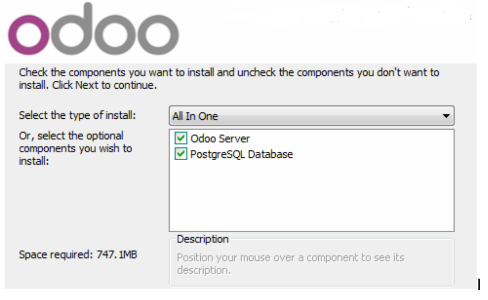 

Una vegada completat procés d’instal.lació inicial se’ns demana el la creació de la base de dades de la nostra empresa

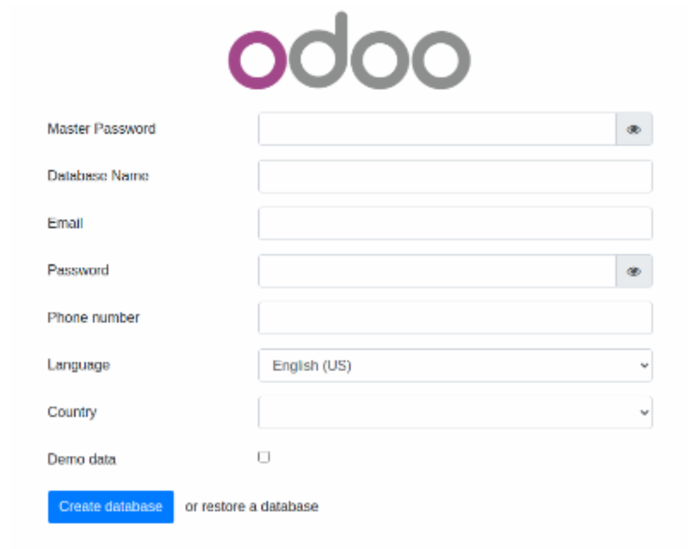 

**Contrasenyes:**

1. Master Password (Contrasenya mestra)

* **Funció:** Controla l'accés a la gestió de bases de dades des del *Database Manager* d’Odoo.  
* **Serveix per a:**  
  * Crear noves bases de dades  
  * Esborrar bases de dades existents  
  * Fer còpies de seguretat o restaurar-les  
* **Important:** No és la contrasenya d’un usuari dins d’Odoo, sinó una clau d’administració global per a la instància.

2. Password de la base de dades (usuari `admin`)

* **Funció:** És la contrasenya del primer usuari administrador que es crea dins la nova base de dades.  
* **Serveix per a:**  
  * Accedir a l’entorn d’Odoo com a usuari `admin`  
  * Configurar mòduls, usuaris, permisos, etc.  
* **Important:** Aquesta contrasenya només afecta la base de dades que estàs creant en aquell moment.

A la resta de camps posem el corresponent

# Procés general d’instal·lació d’un sistema ERP-CRM

Més enllà dels passos concrets d’Odoo (contrasenyes i creació de la base de dades), el procés general d’instal·lació d’un ERP-CRM segueix aquests passos:

1. **Comprovació de requisits previs:** maquinari mínim (CPU, RAM, disc) i sistema operatiu compatible.  
2. **Instal·lació del sistema gestor de bases de dades** (PostgreSQL en el cas d’Odoo) i creació de l’usuari que utilitzarà l’aplicació.  
3. **Instal·lació del programari ERP-CRM** (paquet natiu, codi font, o contenidor Docker).  
4. **Primera execució i configuració inicial:** creació de la base de dades de l’empresa i definició de les contrasenyes d’administració.  
5. **Instal·lació/activació dels mòduls necessaris** segons les necessitats de l’empresa.  
6. **Configuració de xarxa i accessos** (port, domini, HTTPS) perquè els usuaris hi puguin accedir.  
7. **Càrrega de dades inicials** (importació de clients, productes, etc.) si es disposa de dades prèvies.

# Tipus d’instal·lació

Els sistemes ERP-CRM es poden instal·lar seguint diferents arquitectures:

* **Monolloc (o monopuesto):** tota l’aplicació (interfície, lògica de negoci i base de dades) s’instal·la en un únic equip, i només aquest equip hi pot accedir. Adequada per a autònoms o microempreses amb un únic lloc de treball.  
* **Client-servidor:** el sistema s’instal·la en un servidor central (que allotja la base de dades i, sovint, la lògica de negoci) i els usuaris hi accedeixen des de diferents equips client de la xarxa local (LAN). Permet treball multiusuari i centralitza la informació.  
* **Al núvol (cloud):** el sistema s’allotja en servidors externs i s’hi accedeix via internet des de qualsevol lloc amb un navegador. Redueix la necessitat d’infraestructura pròpia i facilita l’accés remot i l’escalabilitat.

# Modalitats de desplegament

**Odoo Enterprise**

* Odoo Online (SaaS)  
  * Odoo allotja el sistema al seu propi núvol.  
  * No cal preocupar-se per servidors, actualitzacions ni manteniment: tot està gestionat per Odoo.  
  * El pagament és per usuari/mes \+ mòduls, i inclou hosting i suport.  
  * És la forma més senzilla i ràpida d’usar Enterprise.  
* Odoo.sh (PaaS)  
  * És una plataforma al núvol gestionada per Odoo, però amb més flexibilitat que el SaaS.  
  * Permet personalitzar codi, instal·lar mòduls propis i fer integracions.  
  * Odoo s’encarrega de la infraestructura, però tu tens més control sobre el projecte.  
* On-premise (instal·lació pròpia)  
  * També pots instal·lar Odoo Enterprise en els teus servidors locals o en un núvol privat.  
  * Aquí el cost de llicència segueix sent per usuari/mes, però el hosting i manteniment van a càrrec teu o del teu partner.

Odoo Community

* **On-premise (servidors locals o privats)**  
  * Instal·lació directa en servidors de l’empresa.  
  * Dona control total sobre configuració, seguretat i personalització.  
  * Requereix coneixements tècnics interns o suport d’un partner.  
  * Ideal per organitzacions que volen independència i adaptar el sistema a mida.  
* **Cloud hosting (núvol privat o proveïdor extern)**  
  * Odoo Community es pot allotjar en serveis com AWS, Azure, Google Cloud o proveïdors locals.  
  * Escalabilitat i flexibilitat, amb menys inversió inicial en infraestructura.  
  * El cost depèn del proveïdor de núvol i del manteniment contractat.  
  * Molt utilitzat per pimes que volen evitar la gestió de servidors físics.  
* **Docker / Containers**  
  * Desplegament mitjançant imatges Docker, molt popular per a entorns de desenvolupament i producció.  
  * Facilita la **reproductibilitat** i la gestió de versions.  
  * Permet escalar ràpidament i integrar-se amb pipelines DevOps.  
  * És una opció recomanada per equips tècnics que busquen modularitat i rapidesa en desplegaments.  
* **Entorns híbrids**  
  * Combinació de servidors locals i núvol (per exemple, base de dades en núvol i aplicació en local).  
  * Dona flexibilitat, però requereix una gestió més complexa.

# Actualització del sistema ERP-CRM

Mantenir el sistema actualitzat és fonamental per garantir la seguretat i el bon funcionament de l’ERP-CRM:

* **Actualització de mòduls:** quan es modifica el codi d’un mòdul (propi o de tercers) cal actualitzar-lo perquè Odoo apliqui els canvis a la base de dades (nous camps, vistes, dades per defecte). Es fa des de **Apps**, seleccionant el mòdul i triant l’opció **Actualitzar**.  
* **Actualització de versió major** (p. ex. d’Odoo 17 a Odoo 18): sol requerir un procés de migració, ja que poden canviar l’estructura de dades i l’API.  
* **Bones pràctiques abans d’actualitzar:**  
  * Fer una còpia de seguretat (backup) de la base de dades abans de qualsevol actualització.  
  * Provar l’actualització primer en un entorn de proves/preproducció abans d’aplicar-la a producció.  
  * Revisar el registre de canvis (*changelog*) del mòdul o versió per detectar incompatibilitats.  
* **Odoo Online (SaaS):** les actualitzacions les gestiona el mateix Odoo de forma automàtica. **On-premise / Odoo.sh:** la responsabilitat d’actualitzar recau en l’empresa o el partner tècnic.

# Privilegis

Els privilegis d’un usuari son el següents:

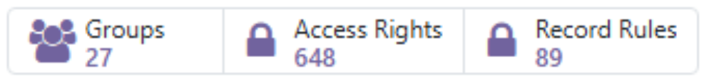 

## Grups de seguretat (Rols funcionals)

Els **grups** són conjunts d'usuaris que comparteixen certs permisos o funcionalitats. 

* Usuari de Vendes  
* Usuari d’Inventari  
* Usuari de Comptabilitat  
* Administrador de Projectes

És la **capa superficial**: Controlen quins mòduls, menús i pantalles pot veure un usuari. 

## Regles d’accés

Controlen si pots fer les següents accions sobre objectes com productes, comandes, factures, etc.:

* Llegir  
* Crear  
* Escriure  
* Esborrar

És la **capa mitjana**: controla les accions que pots fer a nivell de model.

## Regles de registre

Controlen **quins registres concrets** pots veure o modificar.

* Només pots veure les teves vendes  
* Només pots editar ordres del teu magatzem  
* Només pots accedir a clients de la teva empresa

És la **capa profunda**: controla les dades que pots accedir

## Grups del sistema

### Superficial (activació de mòduls)

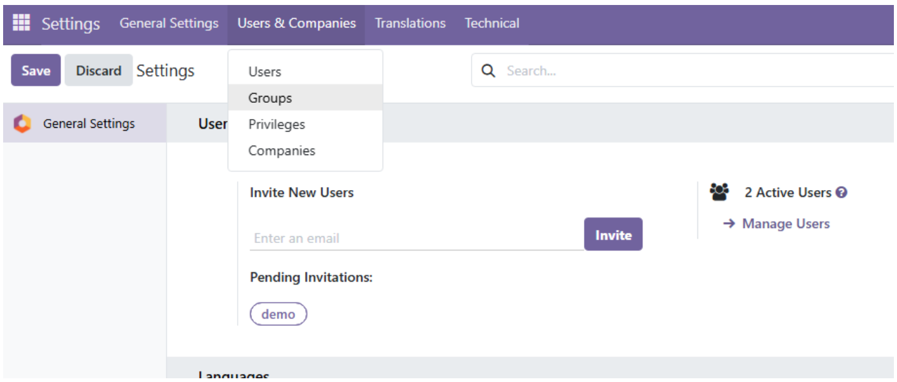 

Aquí podem veure tots els grups en una instal·lació nova, sense cap mòdul instal·lat.  
La columna privilege, afegeix extra permisos a sobre dels que ja té el grup per accedir a mòduls.

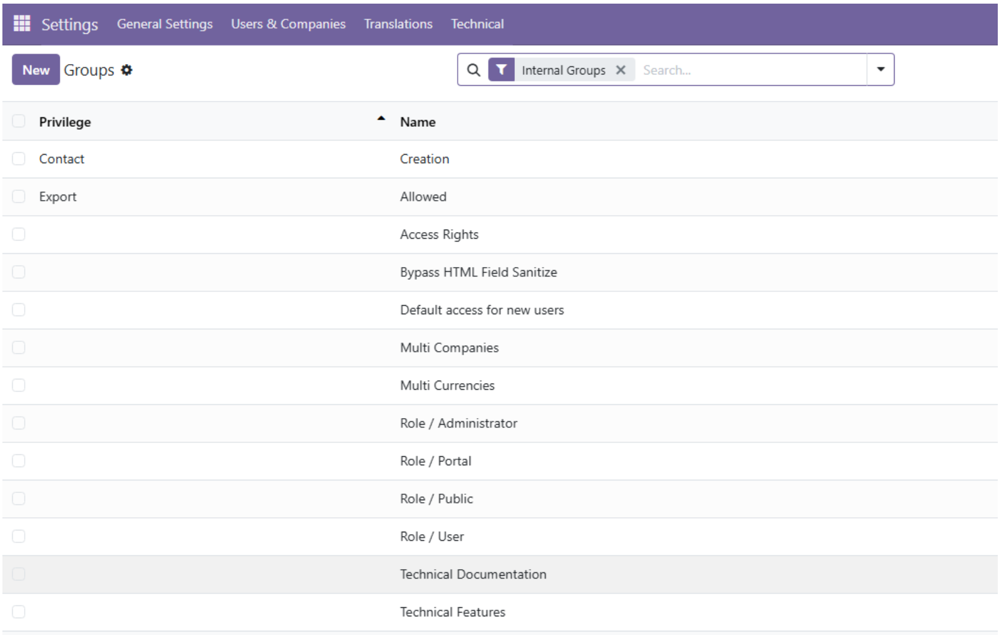 

Si entrem a dintre d’un grup, com per exemple Role/Portal podrem veure qui està assignat

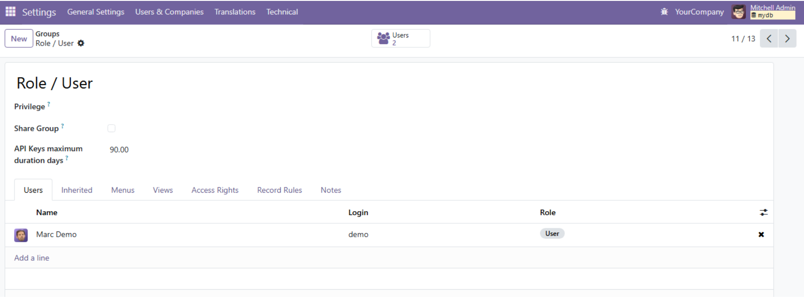 

Si ens anem a APPS i activem el mòdul Sales, llavors ens apareixen nous grups pertanyents al mòdul sales.

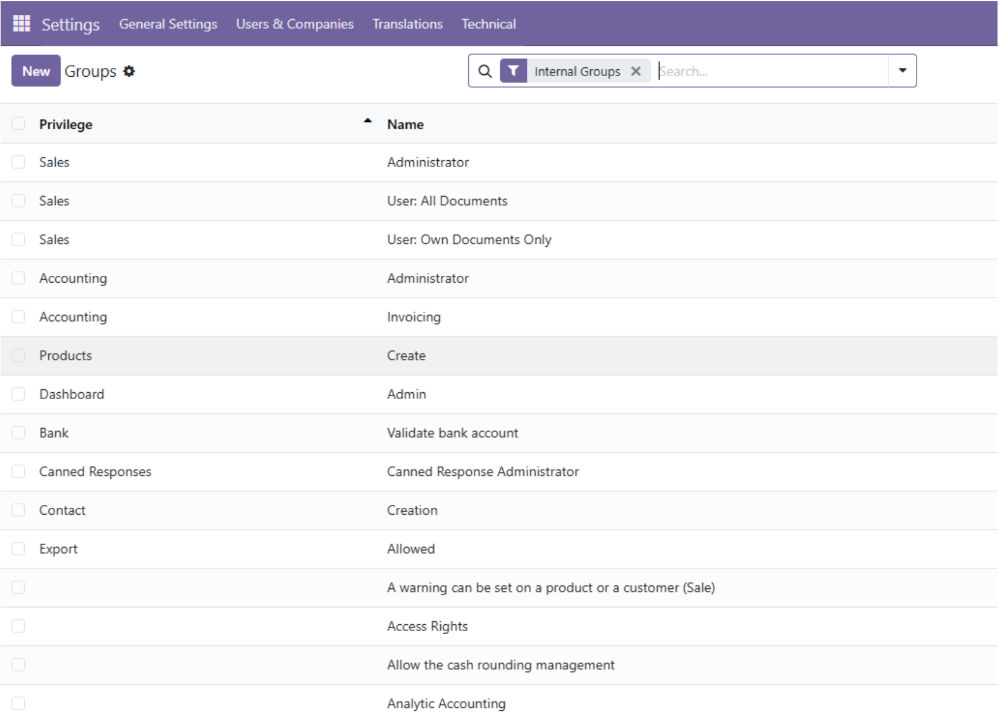 

## Privilegis del sistema

### Mitjà i profund (Access Rights \+ Record Rules)

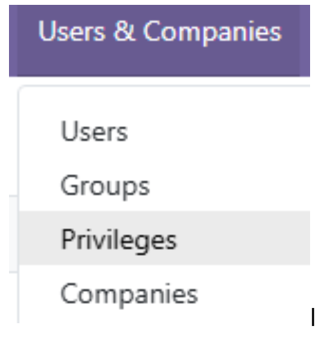 

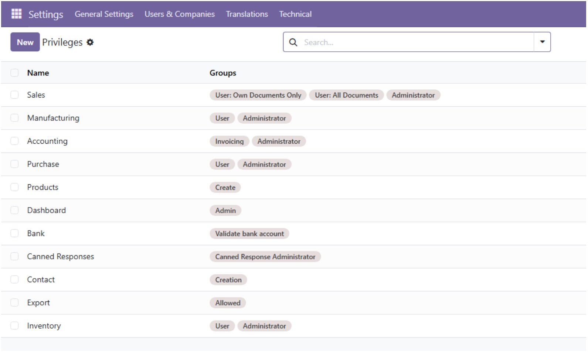 

# Settings

A l’apartat **Settings** podem accedir a la configuració dels mòduls que ja tenim activats.

Podem configurar tant la plataforma Odoo en **General Settings** com els propis mòduls per separat.

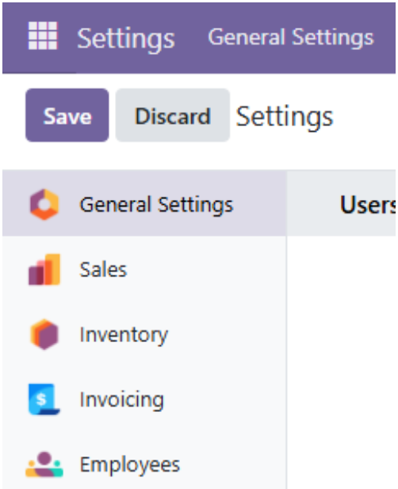 

# Contacte

Un contacte és qualsevol persona o organització amb qui la teva empresa interactua.

Pot representar:

* Un usuari del sistema  
* Una empresa  
* Una persona  
* Un client  
* Un proveïdor  
* Un empleat vinculat  
* Una adreça (enviament, facturació, seu)  
* Un subcontacte dins d’una empresa

Tot això és el mateix objecte: res.partner.

## Usuari

Un usuari és qualsevol persona que pot iniciar sessió a Odoo amb credencials pròpies.

* Està basat en un contacte.  
* Té accés a la interfície web.  
* Està vinculat a un grup que defineix què pot veure i fer.  
* Pot ser un administrador, un usuari intern, un usuari de portal, etc.  
* Es crea des de Configuració \> Usuaris.

Exemple: Un comptable que accedeix a Odoo per gestionar factures és un usuari.

### Afegir un usuari

* Per afegir un usuari ens anem a **Settings \> Users & Companies \> Users** o bé a **Manage Users** (a la dreta)

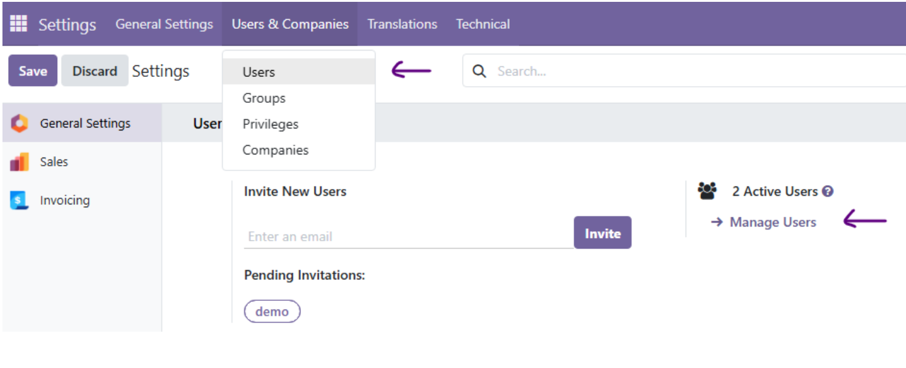 

* Veurem els actuals usuaris i la opció de crear-ne de nous

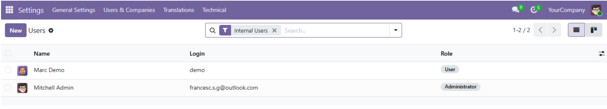 

* Creem un nou usuari i li donem un nom d’usuari amb el que pugui entrar al sistema.

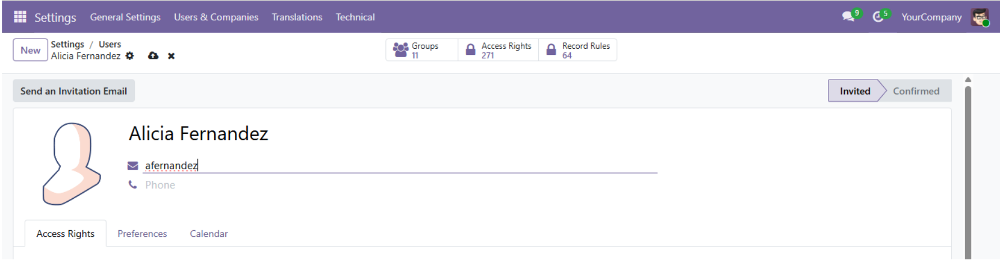 

* Li asignem els rols dintre de l’empresa. En aquest cas el rol d’usuari. I a quina delegació pertany.

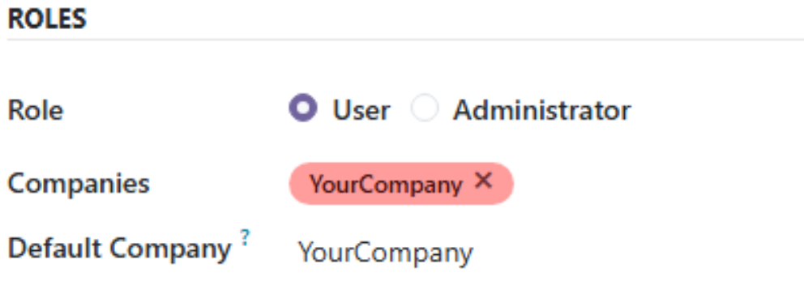 

* Li posem un contrasenya donant a **Change password**. Idealment l’usuari hauria de poder rebre un mail per poder-la canviar pero no tenim un servei de missatgeria vinculat a Oddo encara.

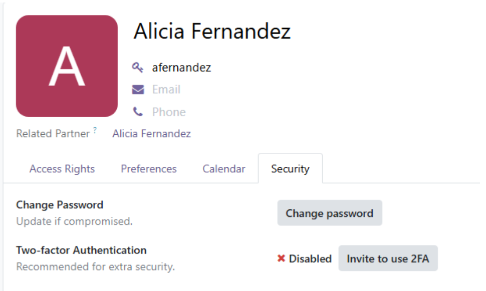 

* Aquí canviem la contrasenya

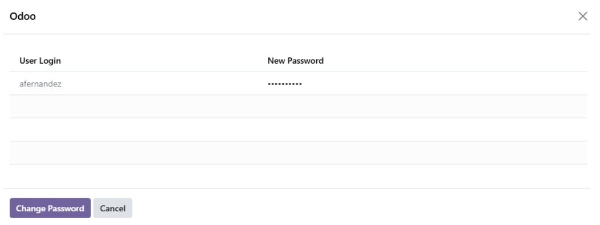 

* Li donem permisos per accedir als documents del mòdul de vendes (en aquest cas podem donar-li accés als documents de vendes perquè el mòdul està activat, per això apareix)  
* Per a que no tingui accés als altres mòduls eliminem qualsevol informació que pugui haver als camps i ho deixem tot en blanc menys el mòdul de vendes.

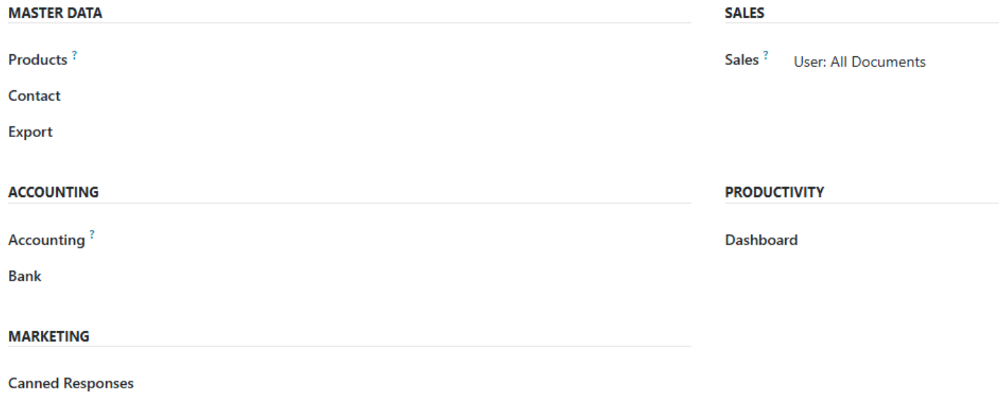 

* Dalt de la secció de l’usuari podem veure els grups a que pertany i els permisos que té

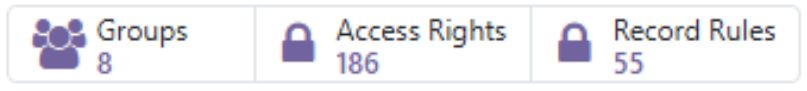 

* Si entrem a **grups** podrem veure els privegis que té y els grups a que pertany:

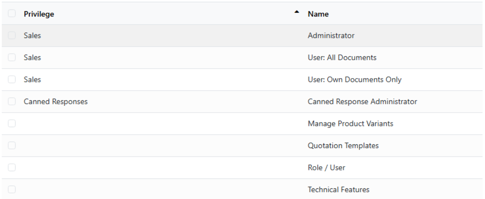 

La primera linea diu que l’usuari té privilegi per accedir al mòdul de **Vendes (Sales)** i pot administrar aquest mòdul perquè està dintre del grup d’**Adminstradors**

La següent línia diu que l’usuari té accés al mòdul de **Vendes (Sales)** i està al grup **d’usuaris amb accés a tots el documents**.

En el cas de l’usuari que hem creat abans, al assignar-lo al grup **User: All Documents**, automàticament s’assigna al grup d’**Administrators** i d’**Usuaris amb accés únicament als seus documents**

Si treiem l’usuari del grup **Sales / User: All Documents** automàticament sortirà dels grups d’**Administrators** i d’**Usuaris amb accés únicament als seus documents**.

Resumint, a la columna de l’esquerra seria els privilegis als mòduls i a la dreta els grups als que pertany, relacionats amb un mòdul o no. Perquè como podem veure hi han grups sense privilegi a la columna de l’esquerra. Per exemple: El grup amb el **Rol d’Usuari** al no pertànyer a cap mòdul, només està a la columna de grups, i el mateix passa amb **Quotation Templates**, **Technical Features**, etc.

## Empleat

Un empleat és un registre dins del mòdul de Recursos Humans (HR).

* No necessita tenir accés al sistema (no és obligatori que sigui usuari).  
* S’utilitza per gestionar nòmines, contractes, assistència, departaments, etc.  
* Es crea des de Recursos Humans \> Empleats.  
* Pot estar vinculat a un usuari, però no sempre.

Exemple: Un operari de fàbrica que no accedeix a Odoo però cal gestionar la seva jornada laboral és un empleat.

| Cas | Té accés a Odoo? | Apareix com a empleat? |
| :---- | :---- | :---- |
| Usuari intern | Sí | Opcional (si està vinculat) |
| Empleat sense usuari | No | Sí |
| Administrador | Sí | Opcional |
| Portal (client extern) | Limitat | No |

Molts cops no es necessari que un empleat accedeixi a Odoo, un encarregat pot gestionar qualsevol cosa que li correspongui. També d’aquesta manera l’empresa s’estalvia diners.

### Afegir Empleat

* Per afegir un empleat primer activem el mòdul empleats

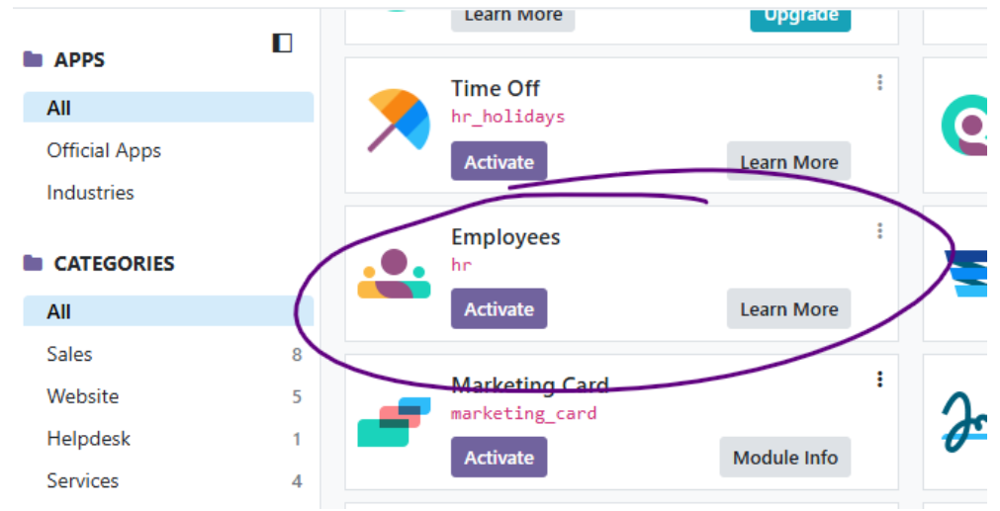 

* Si hem carregat la demo data prèviament podrem veure ara molts treballadors

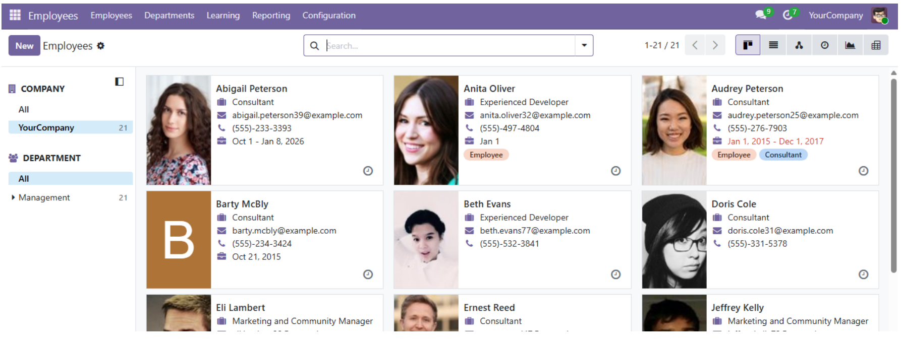 

* Anem a Departments i podem veure els que hi ha en aquests moments, podent crear de nous.

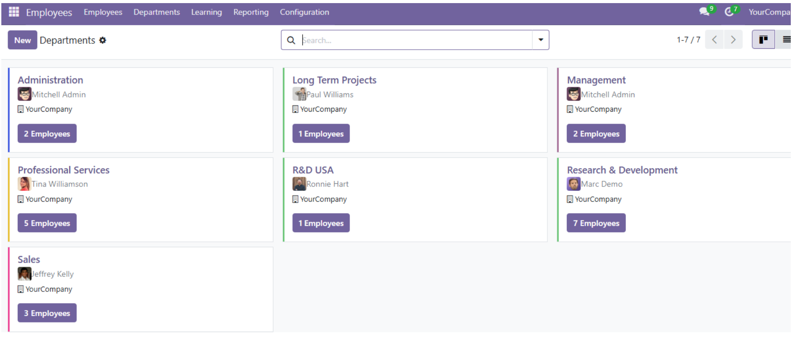 

* Creem un empleat doncs  
* Podriem crear un usuari al vol a la vegada que creem l’empleat a través del botó **Create User** però ara o fem per separat.

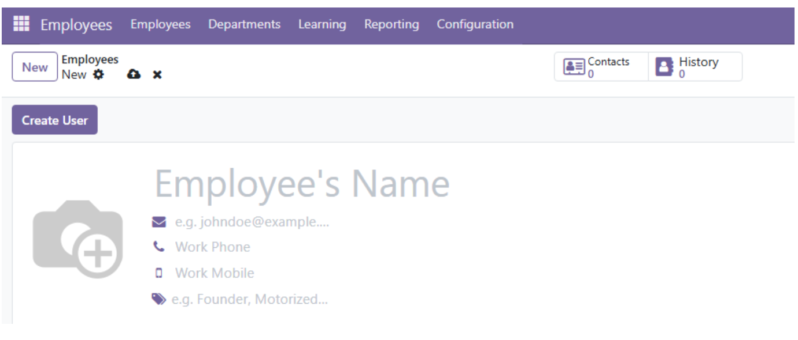 

Aquí vindria la part on omplim la fitxa de l’empleat, amb el seu departament, càrrec, nom del seu rol professional i qui té per d’amunt

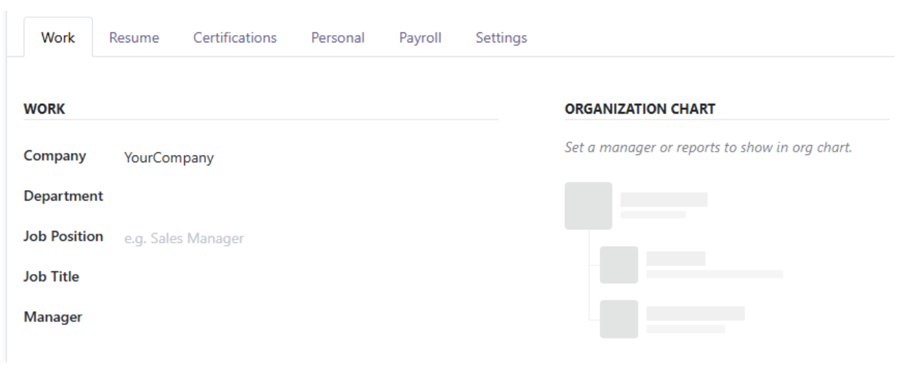 

* Omplim dades a partir del que ens ofereix la base de dades quan volem accedir a un camp

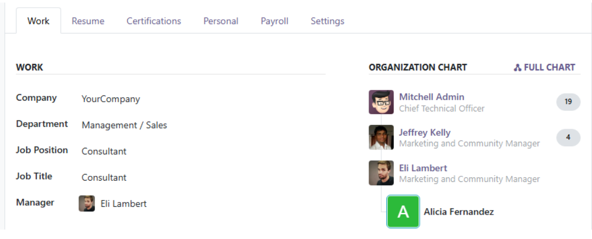 

* En aquestes pestanyes (Resume, Certifications, Personal i Payroll) podem emplenar la resta de dades de l’empleat

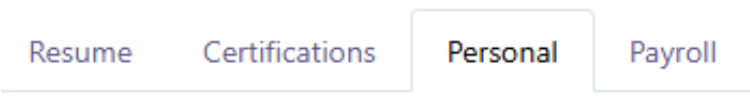 

### Vinculació del usuari i l’empleat

* Després ens anem a Settings

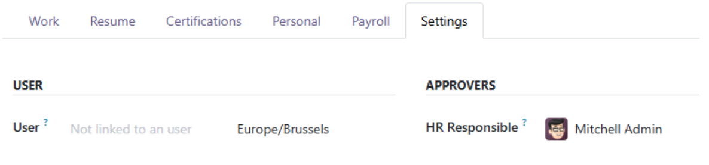 

* Aquí ja podem assignar-li l’usuari avans creat

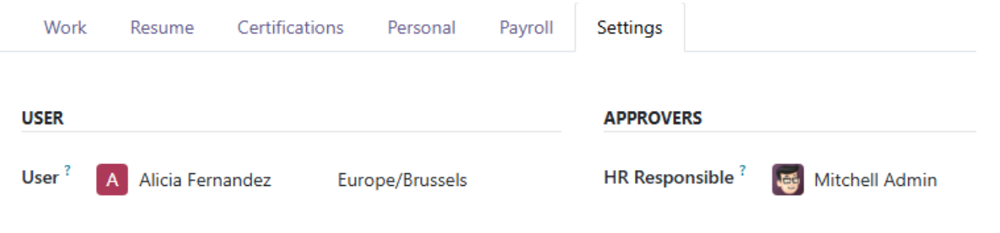 

* Ja tenim l’empleat vinculat amb l’usuari\!

# Mòduls

Odoo és un sistema de gestió empresarial format per mòduls. Molts venen amb el propi software i d’altres és poden importar o desenvolupar específicament per a cada cas.

Cap mòdul ve activat per defecte, els em d’activar nosaltres. Pero apareixen visibles, al menys per poder veure quins estan disponibles.

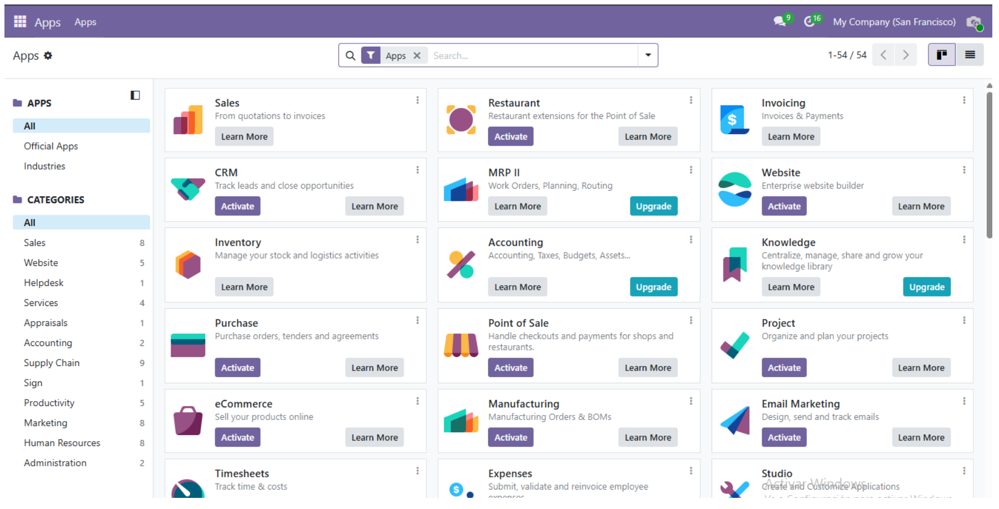 

Els mòduls activats apareixen visibles en el desplegable quan cliquem a sobre de la icona del menú.

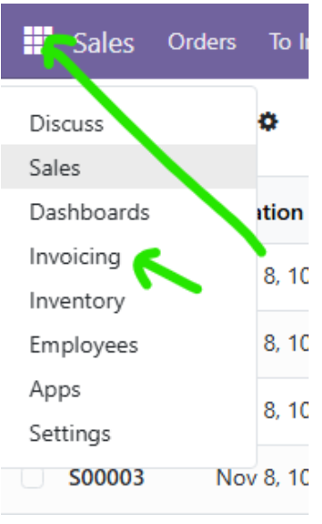 

## Dependències

Molts dels mòduls depenen entre si.

**Mòdul d’Inventari**

El mòdul d’inventari sempre depèn de:

* Mòdul de productes.

Perquè no pots gestionar estoc si abans no existeixen:

* Productes.

**Mòdul de Vendes**

El mòdul de vendes depèn de:

* Productes  
* Clients  
* Facturació (en alguns ERPs)

Perquè per fer una venda necessites:

* Un producte  
* Un client  
* Un document de venda/factura

**CRM**

El CRM depèn del mòdul:

* Contactes

Perquè una oportunitat comercial sempre està vinculada a:

* Un contacte  
* Una empresa

# 

# Bases de dades

Odoo permet crear varies bases de dades a les quals es pot tenir associada una o varies empreses. D’aquesta manera es crea un aïllament entre les empreses que corresponen a cada BBDD.

## Avantatges de fer servir diferents bases de dades

### Aïllament total entre empreses (seguretat i confidencialitat)

Ideal quan tens **clients diferents** o **projectes independents**.

Exemple:

Ets una consultoria i tens:

* Client A → BBDD\_A  
* Client B → BBDD\_B  
* Client C → BBDD\_C

Cap client pot veure dades dels altres.  
Cap error de configuració pot afectar-los.  
Cap usuari pot accedir a una empresa que no és la seva.

### Separar entorns: Producció, Preproducció i Desenvolupament

Aquí no es crea la BBDD si no que es duplica per poder treballar sobre les dades clonades i veure si els canvis no trenquen res.

Exemple:

* BBDD\_PROD → dades reals  
* BBDD\_PRE → proves abans de passar a producció  
* BBDD\_DEV → proves de programació, mòduls, scripts

Així pots:

* Provar mòduls sense trencar res  
* Fer migracions de versió  
* Testejar fluxos de vendes o inventari

Evites desastres en producció

### Empreses que no tenen cap relació entre elles

Si tens empreses que no comparteixen:

* Productes  
* Clients  
* Comptabilitat  
* Inventari  
* Usuaris

Llavors no té sentit posar-les a la mateixa base de dades.

Exemple:

* Una empresa de reformes  
* Una botiga online  
* Una acadèmia

Si totes són teves però no tenen res a veure, millor separar-les.

### Diferents països amb fiscalitats incompatibles

Hi ha casos on la multiempresa dins la mateixa BD és un maldecap:

* IVA diferent  
* Llibres comptables diferents  
* Normatives locals  
* Idiomes i formats de data  
* Localitzacions que xoquen entre si

Exemple:

* Empresa a Espanya  
* Empresa a Mèxic  
* Empresa a Alemanya

És molt més net tenir:

* BBDD\_ES  
* BBDD\_MX  
* BBDD\_DE

Evites conflictes de localització i configuració **PERÒ** el problema és que les empreses no estan interconectades. Llavors s’ha de valorar si els pros i els contres.

### Quan una empresa vol “reiniciar” sense perdre l’històric

Això passa molt sovint.

Exemple:

* L’empresa ha fet servir Odoo 3 anys  
* Té dades brutes, proves, errors, duplicats  
* Vol començar de zero però conservar l’històric

Solució:

* BBDD\_ANTIGA (només lectura)  
* BBDD\_NOVA (operativa)

És com tenir un arxiu i un sistema net.

### Quan vols comparar configuracions o provar escenaris

Per exemple:

* Provar un nou flux de vendes  
* Testejar un mòdul de comptabilitat  
* Comparar dues configuracions d’inventari

Tens:

* BBDD\_TEST1  
* BBDD\_TEST2

Ideal per a docència i consultoria.

## Compartir Bases de dades

### Compartir l’accés a l’Odoo a través de la xarxa local

Permet que altres persones accedeixin al teu Odoo des d’una altra màquina de la mateixa xarxa.

* Els dos pc’s tenen que estar conectats sota la mateixa xarxa.  
* La conexió wifi dels dos pc’s té que tenir la xarxa privada activada.  
* S’ha de crear un regla d’entrada al firewall del pc amfitrió que permeti l’entrada desde fora all port on estigui corrent l’Odoo.  
* S’ha de crear un regla de sortida al firewall del pc invitat que permeti l’entrada al port on estigui corrent l’Odoo del pc amfitrió.  
* Al pc invitat accedeix al pc amfitrió: **http://ip\_de\_l’amfitrio:port\_que\_sigui**  
  * Exemple:  **http://192.168.1.10:8070**

### Compartir la BBDD entre dockers de diferents persones

* Entrem dintre del contenidor de Posgres (La BBDD):  
    
  	**docker exec \-it** nomdelcontenidordepostgres **bash**  
    
* Fem un backup de la base de dades que volem:

  **pg\_dump \-U odoo \-Fc postgres \> /tmp/backup.dump**  
    
* Sortim del contenidor de la base de dades y copiem el backup a la carpeta on tenim el arxiu yml

  **pg\_dump \-U odoo \-Fc postgres \> /tmp/backup.dump**  
    
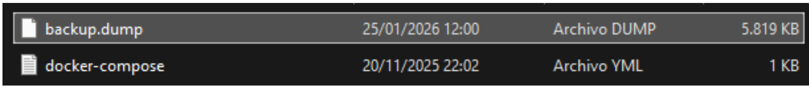 

Li pasem el arxiu al nostre company.

* El nostre company posa l’arxiu backup.dump en el mateix lloc i l’importa a la bbdd del seu contenidor. Aquesta comanda sobrescriu la seva base de dades actual:

**docker exec \-i odoo-db \\**  
**pg\_restore \-U odoo \-d postgres \< backup.dump**

* Si es vol aplicar sobre una bbdd nova llavors primer creem una nova bbdd:

**docker exec \-it odoo-db \\**  
**createdb \-U odoo nova\_bd**

* Ara restaurem sobre aquest nova bbdd:  
    
  **docker exec \-i odoo-db \\**

**pg\_restore \-U odoo \-d nova\_bd \< backup.dump**

# Altres serveis d’accés al sistema ERP-CRM

A banda de l’accés per xarxa local ja descrit, un sistema com Odoo pot oferir altres serveis d’accés que cal conèixer i configurar:

* **Accés web (HTTP/HTTPS):** Odoo s’exposa per defecte pel port 8069 (HTTP); en un entorn de producció es recomana posar-hi al davant un servidor web (Nginx/Apache) que faci de proxy invers i xifri la connexió amb HTTPS (certificat SSL/TLS).  
* **API externes (XML-RPC, JSON-RPC):** Odoo permet connectar-se des d’aplicacions externes (webs, scripts, altres sistemes) mitjançant aquests protocols per llegir o escriure dades sense passar per la interfície web.  
* **Accés de portal (usuaris externs):** Odoo permet crear usuaris de tipus **Portal**, pensats perquè clients o proveïdors externs puguin consultar informació concreta (comandes, factures) sense tenir accés complet al sistema intern.  
* **Accés remot / VPN:** en instal·lacions on-premise, si no es vol exposar el servidor directament a internet, es pot configurar l’accés mitjançant una xarxa privada virtual (VPN) perquè els usuaris externs es connectin de manera segura com si fossin a la xarxa local.

# Verificació del funcionament de l’ERP-CRM

Un cop instal·lat i configurat el sistema, cal verificar que funciona correctament:

* **Verificació de l’accés:** comprovar que els usuaris es poden autenticar correctament i que veuen només els mòduls i dades que els correspon segons els seus grups/permisos.  
* **Verificació dels mòduls instal·lats:** comprovar que els mòduls activats es carreguen sense errors i que les seves funcionalitats bàsiques operen correctament (p. ex. crear un client, un producte o una comanda de prova).  
* **Verificació de la connexió a la base de dades:** comprovar que les dades es desen i es recuperen correctament, i que no hi ha errors de connexió amb PostgreSQL.  
* **Verificació de les rutes logístiques i automatismes:** provar que les regles de proveïment (reactiu/preventiu) s’executen quan toca.  
* **Verificació dels serveis d’accés:** comprovar que l’accés per xarxa local o des de fora (si escau) funciona amb els ports i regles de tallafoc configurats.  
* **Registre de proves:** deixar constància de les proves realitzades i el resultat obtingut, per poder detectar regressions en actualitzacions futures.

# Documentació de les operacions i incidències

## Documentació de les operacions realitzades

Cal registrar les instal·lacions i configuracions fetes (versió d’Odoo instal·lada, mòduls activats, usuaris i grups creats, paràmetres de configuració modificats) perquè quedi constància del que s’ha fet i es pugui reproduir o auditar en el futur.

## Documentació de les incidències

* **Què s’ha de documentar d’una incidència:** data i hora, descripció del problema, passos per reproduir-lo (p. ex. un mòdul que no s’activa, un usuari que no té els permisos esperats, un error en importar dades), missatge d’error o log associat, causa detectada i solució aplicada.  
* **Eines habituals:** un document/wiki intern, un sistema de tiquets (Jira, Redmine, GLPI), o els propis registres (logs) d’Odoo.  
* **Per què és important:** facilita el manteniment, permet donar suport a altres tècnics o al client, i genera un historial útil per a futures instal·lacions o migracions similars.
