# Odoo

# Model

Un **model** en Odoo és una classe que defineix els camps, les operacions i les regles d’un tipus d’objecte (producte, factura, comanda, usuari, etc.)

Tots els models estan definits en codi Python i hereten de `models.Model`.

## Cada model defineix:

* **Camps** (com columnes): nom, preu, data, estat…  
* **Regles de seguretat** (Access Rights, Record Rules)  
* **Vistes** (com es mostra a l’usuari)  
* **Accions** (botons, menús, comportament)  
* **Relacions** amb altres models (Many2one, One2many…)

Exemple visual

El model `sale.order` conté:

* Camps: client, data, línies de comanda, estat  
* Relació amb `sale.order.line` (línies de producte)  
* Botons: confirmar, cancel·lar, enviar  
* Vistes: llista, formulari, kanban  
* Regles: qui pot veure o editar comandes

## Models essencials

**res.users**  
 Gestiona els usuaris del sistema.

**res.partner**  
 Contactes, clients, proveïdors i empreses. És un dels models més centrals.

**product.template**  
 La definició general d’un producte (nom, categoria, preu, rutes…).

**product.product**  
 La variant concreta del producte (color, talla, atributs…).

**sale.order**  
 Les comandes de venda.

**sale.order.line**  
 Les línies de producte dins d’una comanda de venda.

**purchase.order**  
 Les comandes de compra.

# Importació desde fulls de càlcul

Si la informació ha estat emmagatzemada prèviament en fulls de càlcul pels motius que sigui, podrem importar-la, però haurem de seguir els criteris que ens demani Odoo, per exemple a l’hora d’importar clients haurem de respectar els camps establerts.

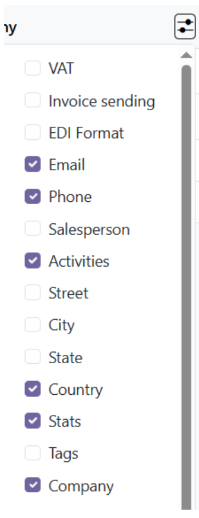 

* Per importar clients podem anar al mòdul Invoicing i dintre entrem a la pestanya de customers

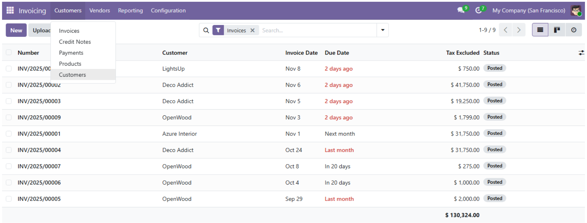 

* Dintre de customers li donem a la icona de l’engranatge i podem importar els nous clients o exportar-los. Una forma de saber quin format aceptaria Odoo podria ser exportar i veure les columnes i els camps que ha generat com a referència per a la nostra importació.  
    
* **IMPORTANT:** Si deixem un camp en blanc vol dir que quedarà per defecte. Si deixem en blanc el camp **Empresa** llavors vol dir que serà visible per a totes les empreses.

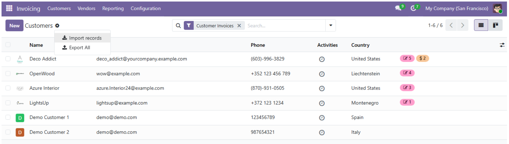 

* Aquí pujeu el full de càlcul  
* **IMPORTANT**: El full de càlcul a de ser en format **delimitat per comes**

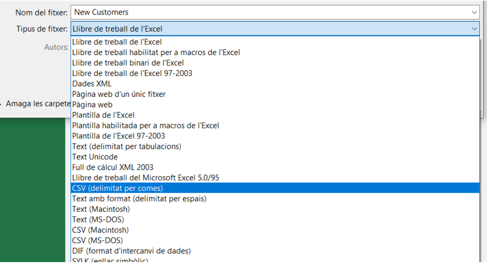 

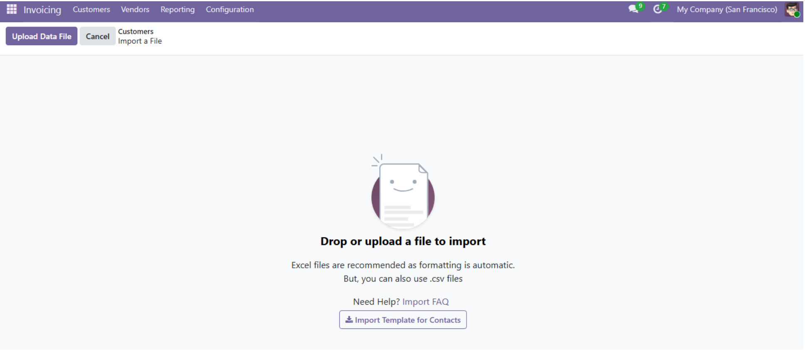 

* Aquí us permet fer una prova amb el botó **Test**, per veure si el contingut del full de càlcul és vàlid o no, si no us avisarà amb missatges demanant-vos que ajusteu la vostra taula al format que ja existeix.

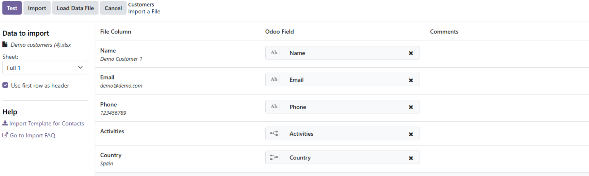 

* Quan tingueu el vostre full de càlcul corregit i el torneu a importar i li doneu a **Test**, si tot és correcte haurieu de veure aquest missatge:

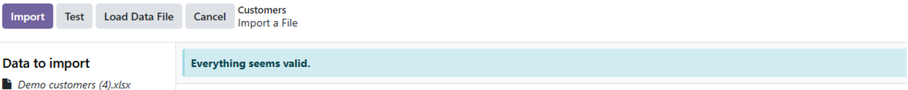 

# Rutes logístiques

Són els camins que segueix un producte en una empresa. Un producte pot ser:

* Manufacturable  
* Comprat al proveïdors  
* Vendible als clients  
* Mogut des d’un magatzem a un altre

Lo ideal és automatitzar certes rutes per evitar quedar-se sense stock.

Per obtenir una ruta primer em d’activar el mòdul corresponent a aquesta ruta, si volem tindre la ruta de compra haurem d’activar el mòdul de compra, si volem activar la ruta de fabricació haurem d’activar el mòdul de fabricació etc

**IMPORTANT:** 

Odoo aproxima les rutes logístiques amb tres punts: **Rutes, Accions i Regles**

* Una ruta és un contenidor d’accions  
* Una acció és el que es fa amb un producte:   
  * Si es fabrica  
  * Si es compra  
  * Si es ven  
  * Si es mou d’un magatzem a un altre  
* Una regla és el que fa que la ruta s’activi en un producte (si es compleixen una serie de condicions)

Les regles es divideixen dos: 

* Regles de rutes logístiques   
* Regles dels productes. 

Cada ruta té les seves regles y cada producte les seves. El vincle d’unió entre els dos tipus es la ruta. Si a un producte li asignes una regla amb una ruta que no coincideix amb la que se suposa que hauria de seguir no farà res.

**Metàfora:**

La ruta és la carretera, les accions són les senyals de tràfic que dirigeixen a un camí o un altre i les regles son els semàfors (si es compleix la regla el semàfor es posa en verd)

## Activació de rutes logístiques

Per activar les rutes logístiques hem d’anar configuració del mòdul **Inventari** i una vegada allà**:**  
**Activar Multi-Step Routes \> Set Warehouse Routes \> Warehouse \> Routes \> Seleccionem la ruta que volem \> Activem el checkbox de Productes**

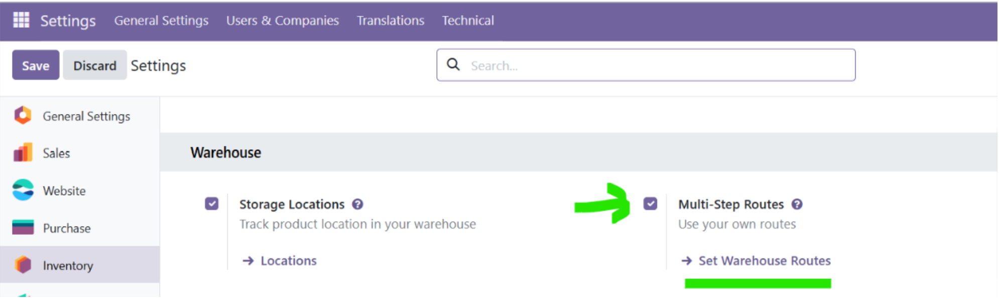 

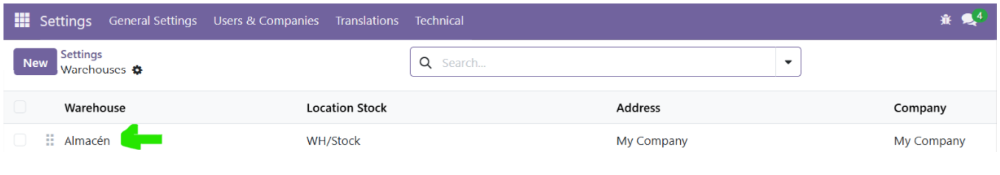 

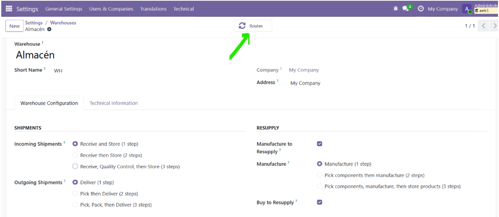 

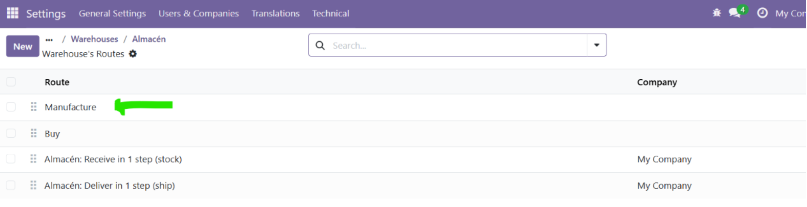 

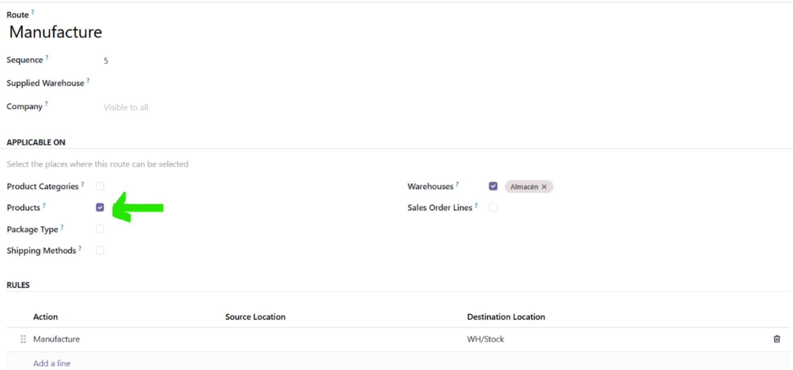 

Com podem veure cada regla es compón d’una **acció**, un **inici** i un **destí**.

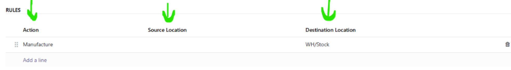 

## Aplicació de rutes logístique als productes

A la secció **Informació General** em d’activar la opció de Seguir Inventari per a que apareguin le regles de proveïment

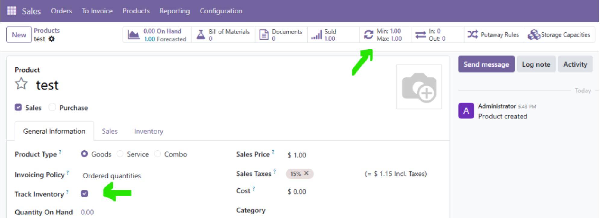 

Una vegada dintre de les regles de proveïment, hem de crear una regla amb la ruta que coincideix amb la ruta que que li volem donar al producte. I la fem automàtica per no tindre que preocupar-nos d’ella, i li establim el mínim que volem d’stock del producte i el màxim, llavors en el moment que ens quedem per sota del mínim establert automàticament s’aplica l’acció que hi ha dintre de la ruta.

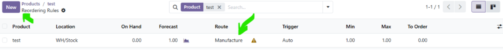 

Per a què una ruta aplicada a un producte s'executi han de passar dues coses, que s'executi una venda o que una regla de proveïment detecti la manca d'estoc i aleshores faci una compra automàtica. La primera es considera un proveïment reactiu i la segona proveïment preventiu.

## Tipus de proveïment

### Proveïment reactiu (per vendes)

* Confirmes una venda  
* Es crea una necessitat immediata  
* Odoo mira les rutes del producte  
* Executa la ruta adequada (Buy, Manufacture, Dropship…)

### Proveïment preventiu (per estoc mínim)

* El scheduler revisa estoc  
* Si baixa del mínim → executa la ruta assignada  
* Aquí sí que es fan servir les Reordering Rules

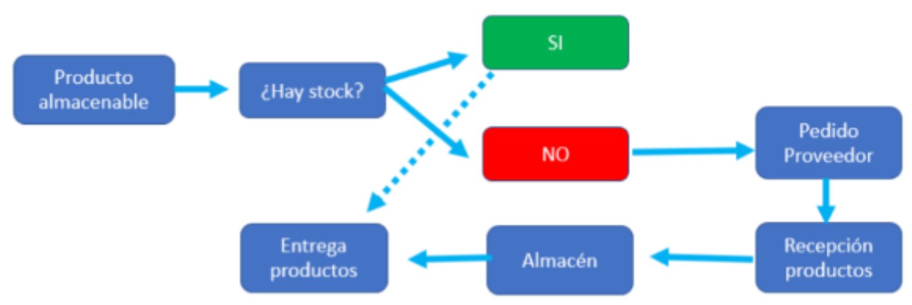 

**Resum en una frase:**

La venda dispara rutes; el stock mínim dispara regles.

# Consultes d'accés a dades

Per obtenir informació concreta d'Odoo sense haver-la de cercar manualment registre a registre, es pot accedir a les dades de diverses maneres:

## Filtres i agrupacions (des de la interfície)

* **Filtres:** permeten mostrar només els registres que compleixen una condició (p. ex. productes amb estoc per sota del mínim). Es poden fer servir els filtres predefinits o crear-ne de personalitzats des de la lupa de cerca.
* **Agrupar per:** permet organitzar el llistat segons un camp (p. ex. moviments d'estoc agrupats per magatzem o per producte).
* **Filtres personalitzats:** permeten combinar diverses condicions amb operadors AND/OR (p. ex. "Magatzem = Barcelona" I "Data >= fa 30 dies").

## Consultes amb l'ORM (domini)

Des de l'Odoo shell o des de codi Python es pot consultar qualsevol model amb un **domini**:

env\['product.template'\].search(\[('qty\_available', '\<', 10)\])

Aquest domini és equivalent a aplicar un filtre des de la interfície, però permet automatitzar-lo o combinar-lo amb altres operacions.

## Consultes SQL directes

Per a consultes més complexes (informes creuant diverses taules, agregacions) es pot consultar directament la base de dades PostgreSQL amb `psql` o pgAdmin:

SELECT name, qty\_available FROM product\_template WHERE qty\_available \< 10;

# Interfícies d'entrada de dades i formularis

Un **formulari** és la interfície que permet a l'usuari introduir o consultar la informació d'un registre (un producte, un client, una comanda...).

## Adaptar un formulari a un procés concret

Sovint el formulari per defecte d'un model conté més camps dels que necessita un procés concret, o li'n falten. Per adaptar-lo:

* Es pot **reorganitzar** en grups i pestanyes (`<group>`, `<notebook>`) perquè només es vegin els camps rellevants per a la tasca que es fa (p. ex. un formulari senzill per registrar comandes de proveïment manual, amb només magatzem, component, quantitat, proveïdor i data).
* Es poden marcar camps com a **obligatoris** (`required="1"`) perquè l'usuari no pugui desar el registre sense omplir-los.
* Es poden establir **valors per defecte** per agilitzar l'entrada de dades repetitiva.

## Per què són importants els formularis ben dissenyats

* Redueixen els errors d'entrada de dades (camps obligatoris, tipus de dada correcte).
* Faciliten la feina a usuaris que no coneixen tècnicament el sistema (magatzem, comercial...).
* Un formulari mal dissenyat (massa camps, camps confusos) provoca que els usuaris introdueixin dades incompletes o incorrectes, cosa que afecta tots els informes i consultes posteriors.

# Informes i llistats de l'aplicació

Els **informes** i **llistats** permeten obtenir, en un document imprimible o exportable, la informació que hi ha al sistema.

## Tipus d'informes habituals

* **Llistats de dades** (vistes de tipus llista/tree): mostren un conjunt de registres amb les columnes escollides, es poden filtrar, agrupar i ordenar, i exportar a Excel/CSV.
* **Documents imprimibles** (factures, albarans, comandes): generats amb plantilles QWeb i exportats a PDF.
* **Informes de moviments/traçabilitat**: permeten seguir el recorregut d'un producte (d'on ve, on és, on va) a través dels diferents magatzems i processos.

## Exportació de dades

Qualsevol llistat es pot exportar (botó d'exportació) a Excel o CSV, triant les columnes que es volen incloure. És útil per compartir informació amb algú que no té accés a Odoo, o per fer-hi anàlisis addicionals en un full de càlcul.

## Qui utilitza cada informe

* **Magatzem/logística:** moviments d'estoc, traçabilitat.
* **Administració/comptabilitat:** factures, albarans.
* **Compres:** llistats de productes amb estoc baix, per planificar comandes.

# Gràfics

Odoo permet representar visualment les dades mitjançant dues vistes complementàries:

## Vista Pivot (taula dinàmica)

Permet encreuar dades en files i columnes amb una mesura (p. ex. quantitat produïda, per magatzem i per mes), de manera similar a una taula dinàmica d'un full de càlcul.

## Vista Gràfic

A partir d'una vista Pivot (o directament), es pot representar la informació com a:

* **Gràfic de barres:** ideal per comparar categories (p. ex. producció per magatzem).
* **Gràfic de línies:** ideal per veure l'evolució en el temps (p. ex. vendes mes a mes).
* **Gràfic circular (pastís):** ideal per veure proporcions (p. ex. percentatge de vendes per producte).

Els gràfics faciliten detectar tendències, pics o caigudes que serien difícils de veure en un llistat de xifres.

# Eines de monitorització i avaluació del rendiment

Verificar que el sistema ERP-CRM respon amb agilitat és important perquè els usuaris puguin treballar-hi còmodament.

## Mesurar el temps de resposta

* Es pot comparar el temps que triga una consulta/informe **sense filtrar** (amb totes les dades) respecte a la mateixa consulta **filtrada** (p. ex. només l'últim mes), per veure l'impacte del volum de dades.

## Ús de recursos del servidor

* Amb `docker stats` es pot veure, en temps real, el consum de CPU i memòria dels contenidors (`odoo`, `db`) mentre s'executa una operació pesada.

## Revisió de logs

* El fitxer `/var/log/odoo/odoo-server.log` permet detectar avisos (`WARNING`) o operacions especialment lentes.

## Possibles millores de rendiment

* Afegir filtres per defecte perquè les vistes no carreguin sempre totes les dades.
* Crear índexs a la base de dades sobre camps molt consultats.
* Paginar els resultats (mostrar-ne menys de cop).

# Incidències: identificació i resolució

Durant l'ús diari d'un ERP-CRM és habitual trobar incidències: un procés que no fa el que hauria, una dada incorrecta, un error inesperat.

## Identificació d'una incidència

Cal saber respondre a aquestes preguntes:

* **Què ha passat?** (descripció del problema)
* **Com es reprodueix?** (passos exactes per tornar a provocar-lo)
* **Quin missatge d'error o comportament s'observa?**

## Resolució

1. Buscar la **causa** (una regla mal configurada, una dada mancant, un permís incorrecte...).
2. Aplicar la **solució** (corregir la configuració, la dada o el codi afectat).
3. **Comprovar** que, un cop aplicada la solució, el problema no torna a passar.

## Documentar la incidència

Cal deixar constància de cada incidència (data, descripció, passos per reproduir-la, causa i solució), per poder-hi tornar en el futur si es repeteix, i per generar una base de coneixement útil per a la resta de l'equip.

# Intel·ligència de negoci (Business Intelligence)

La **Intel·ligència de negoci (BI)** consisteix a transformar les dades que genera dia a dia l'ERP-CRM en informació útil per prendre decisions.

## Panells de control (Dashboards)

Un dashboard combina diversos **indicadors clau (KPI)** i gràfics en una única pantalla, per tenir una visió ràpida de l'estat del negoci. Exemples de KPI:

* Unitats fabricades/venudes en un període.
* Comandes de proveïment pendents.
* Valor total de l'estoc.
* Ticket mitjà de venda.

## De les dades a la decisió

L'objectiu de la BI no és només mostrar dades, sinó ajudar a **respondre preguntes de negoci**:

* Quin magatzem/producte/client genera més valor?
* Hi ha alguna tendència (pujada/baixada) que calgui investigar?
* Quina acció (comprar més estoc, contractar més personal, buscar un altre proveïdor) es desprèn de les dades observades?

Un bon dashboard mostra només la informació rellevant per a qui l'ha de fer servir, evitant sobrecarregar-lo de dades que no aporten valor a la decisió que ha de prendre.

