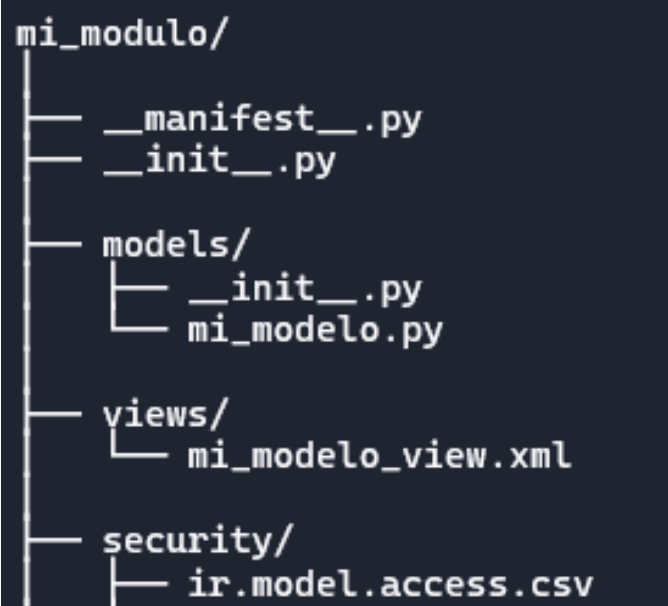
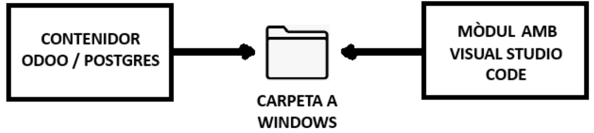
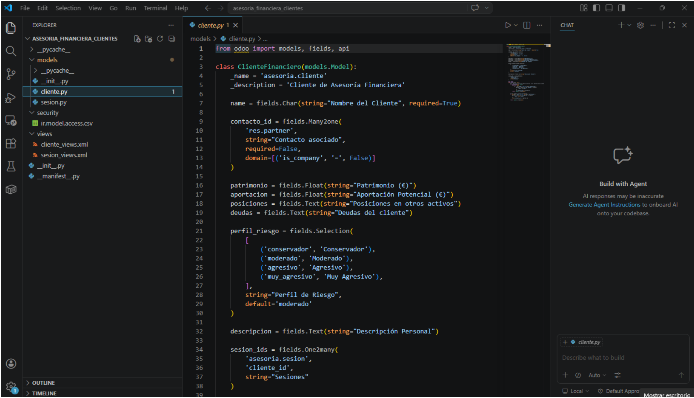
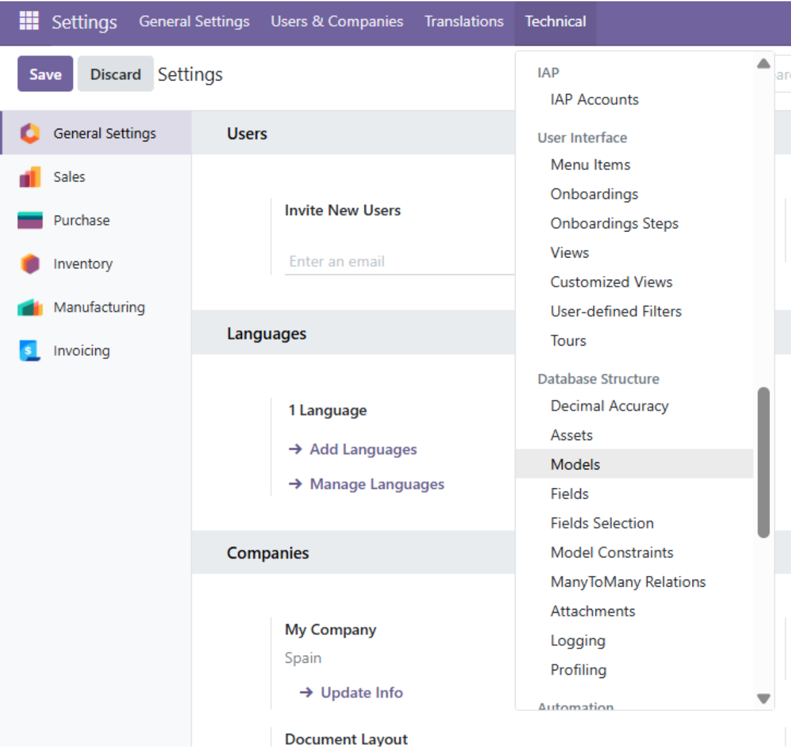
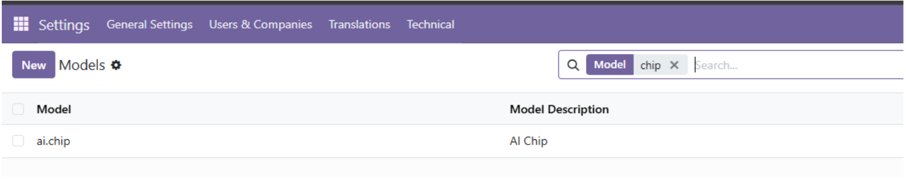
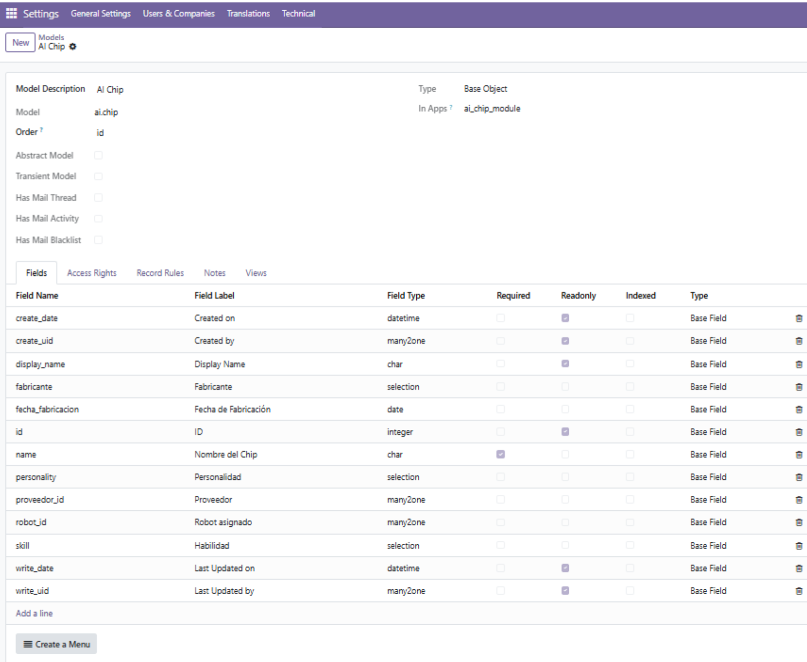

# **Creació d’un mòdul**

# **Mòdul**

Un **módulo en Odoo** es una unidad funcional que añade o modifica características del sistema. Cada módulo está formado por una serie de archivos y carpetas que Odoo reconoce y carga de forma estructurada.

# **Parts d’un mòdul**

## **1\. `__manifest__.py`**

Es el **archivo más importante**. Define la “ficha técnica” del módulo:

* Nombre, versión, autor  
* Dependencias de otros módulos  
* Datos a cargar (vistas, seguridad, datos iniciales)  
* Categoría, descripción, icono  
* Si es instalable o no

Ejemplo:
```py
{  
    'name': 'Mi Módulo',  
    'version': '1.0',  
    'depends': \['base'\],  
    'data': \[  
        'views/mi\_modelo\_view.xml',  
        'security/ir.model.access.csv',  
    \],  
    'installable': True,  
}
```
## **2\. Modelos Python (`models/`)**

Python es un lenguaje de programación de alto nivel, interpretado y de propósito general, reconocido por su sintaxis clara y legible, similar al inglés. Creado en 1991 por Guido van Rossum, es muy popular para inteligencia artificial, ciencia de datos, desarrollo web y automatización. Es de código abierto, gratuito y fácil de aprender para principiantes.

Este video explica qué es Python y por qué es el lenguaje más popular del mundo:

Características principales de Python:

* Fácil de leer y aprender: Utiliza una sintaxis limpia que enfatiza la legibilidad del código.  
* Lenguaje interpretado: El código se ejecuta directamente línea por línea, lo que facilita la depuración.  
* Propósito general: Se puede utilizar para desarrollar casi cualquier cosa, desde sitios web hasta IA.  
* Tipado dinámico: No es necesario declarar el tipo de variable al escribir el código.  
* Orientado a objetos: Soporta la programación orientada a objetos.

Para qué se utiliza Python:

* Inteligencia Artificial y Machine Learning: Es el lenguaje líder para crear algoritmos complejos y modelos de IA.  
* Ciencia de Datos y Análisis: Muy utilizado para analizar grandes volúmenes de datos y crear visualizaciones.  
* Desarrollo Web (Backend): Utilizado en el desarrollo de servidores y la lógica detrás de los sitios web.  
* Automatización y Scripting: Ideal para crear pequeños programas ("scripts") que automatizan tareas repetitivas.  
* Desarrollo de Software: Creación de aplicaciones de escritorio y de servidor.

Empresas como Netflix, Google y la NASA utilizan Python por su eficiencia y versatilidad. Es gestionado por la Python Software Foundation, asegurando su desarrollo y soporte.

Aquí defines la **lógica de negocio**:

* Modelos (`models.Model`)  
* Campos  
* Métodos (create, write, unlink, constraints, lógica personalizada)  
* Herencias de modelos existentes

Ejemplo:

```py
from odoo import models, fields

class MiModelo(models.Model):  
    \_name \= 'mi.modelo'  
    name \= fields.Char()
```

## **3\. Vistas XML (`views/`)**

XML (eXtensible Markup Language) es un lenguaje de marcado basado en texto utilizado para estructurar, almacenar y transportar datos de manera jerárquica y legible tanto para humanos como para máquinas. No es un lenguaje de programación, sino un formato flexible para definir etiquetas propias, ideal para el intercambio de información entre diferentes sistemas y plataformas.

Características Principales y Usos:

* Estructura Jerárquica: Organiza datos mediante etiquetas de apertura y cierre (ej. \<nota\>...\</nota\>), permitiendo anidar información.  
* Independencia de Plataforma: Al ser texto plano, facilita el intercambio de datos entre aplicaciones distintas, por ejemplo, en la facturación electrónica.  
* Archivos de Configuración: Muy utilizado en software para almacenar ajustes (posición, tamaño, etc.).  
* Estándar W3C: Fue desarrollado por el World Wide Web Consortium para estandarizar el marcado de documentos.

Diferencia clave con HTML: Mientras que el HTML utiliza etiquetas predefinidas para mostrar contenido (formato), el XML no tiene etiquetas predefinidas; estas son creadas por el usuario para describir los datos (estructura).

Ejemplo de estructura XML:

```xml
<cliente>  
    <nombre>Juan</nombre>  
    <edad>30</edad>

</cliente>
```
Las vistas son archivos en XML que definen la **interfaz de usuario**:

* Formularios  
* Listas  
* Kanban  
* Wizards  
* Menús y acciones

## **4\. Seguridad (`security/`)**

Controla quién puede hacer qué:

* `ir.model.access.csv` → permisos CRUD por modelo  
* Reglas de registro (`record rules`) en XML

## **5. Datos (`data/`)**

Archivos XML o CSV que cargan:

* Datos iniciales  
* Secuencias  
* Configuraciones  
* Automatizaciones (server actions, cron jobs)

## **6. Archivos estáticos (`static/`)**

Para recursos web:

* CSS  
* JS  
* Imágenes  
* Plantillas QWeb

## **7. Tests (`tests/`)**

Pruebas unitarias o de integración en Python.

## **8. Controladores (`controllers/`)**

Solo si el módulo expone rutas HTTP:

* Controladores web  
* APIs REST  
* Portales

## **9. Plantilles QWeb (`views/` o `static/src/xml/`)** 

Usadas para:

* Reportes PDF  
* Interfaz web (frontend)  
* Widgets

## **Estructura típica de un módulo**

<br>

# **Model**

Un **modelo** en Odoo es, en esencia, la **representación de una tabla de base de datos junto con su lógica de negocio**.  
Es el corazón de cualquier módulo, porque define **qué datos existen**, **cómo se almacenan** y **qué reglas los gobiernan**.

Un **modelo** es una clase Python que hereda de `models.Model` y que:

* Define **campos** (columnas)  
* Define **métodos** (comportamiento)  
* Representa una **tabla SQL** (Odoo la crea automáticamente)  
* Puede **heredar** de otros modelos  
* Se integra con vistas, seguridad, acciones, reportes, etc.

## **Componentes principales de un modelo**

## **1\. Nombre técnico (`_name`)**

Es el identificador único del modelo

```py
_name = 'mi.persona'
```
Esto crea una tabla llamada `mi_persona` en PostgreSQL.

## **2\. Descripción (`_description`)**

Texto descriptivo para el usuario.
```py
_description = 'Persona Demo'
```
## **3\. Campos**

Son los atributos del modelo. Odoo ofrece muchos tipos:

* `fields.Char` → texto  
* `fields.Integer` → números  
* `fields.Boolean` → verdadero/falso  
* `fields.Many2one` → relación  
* `fields.One2many`  
* `fields.Many2many`  
* etc.

Ejemplo:
```py
name = fields.Char(string='Nombre', required=True)  
edad = fields.Integer(string='Edad')  
activo = fields.Boolean(string='Activo', default=True)
```
## **4\. Métodos**

Aquí va la lógica de negocio:

* Validaciones  
* Acciones automáticas  
* Cálculos  
* Overrides de `create`, `write`, `unlink`

Ejemplo:

```py
def es_mayor(self):  
    return self.edad >= 18
```

## **5. Herencia**

Puedes extender modelos existentes:

**Herencia clásica**

```py
class ResPartner(models.Model):  
    _inherit = 'res.partner'

    dni = fields.Char(string='DNI')
```

**Herencia delegada**

```py
class MiModelo(models.Model):  
    _name = 'mi.modelo'  
    _inherits = {'res.partner': 'partner_id'}

    partner_id = fields.Many2one('res.partner')
```

**Ejemplo completo de un modelo:**

```py
class Persona(models.Model):  
    _name = 'mi.persona'  
    _description = 'Persona Demo'

    name = fields.Char(string='Nombre', required=True)  
    edad = fields.Integer(string='Edad')  
    activo = fields.Boolean(string='Activo', default=True)

    def es_mayor(self):  
        return self.edad >= 18
```
# **Pasos previs a la creació d’un mòdul**

## **Arxiu: odoo.conf**

A l’arrel de la carpeta odoo-docker haurem de crear un arxiu **odoo.conf** i dintre posar la següent informació:

```py
[options]  
addons_path = /mnt/extra-addons  
db_host = db  
db_port = 5432  
db_user = odoo  
db_password = odoo  
admin_passwd = admin
```

**Important**: Enrecordeu-vos de que el arxiu no té que ser creat .txt sino **.conf** com fèiem amb els **yml**.

## **Arxiu YML**

A l’arxiu yml farem uns petits canvis. Mapejarem la carpeta on s’afegeixen els mòduls nous a dintre del contenidor d’Odoo amb una carpeta que tindrem al nostre sistema Windows dintre de la típica carpeta odoo-docker. D’aquesta manera el contenidor virtual tindrà accés a la nostra carpeta fora del contenidor i podrà llegir el mòdul nou que hem creat.

```yml
services:  
  odoo:  
    image: odoo:19  
    depends_on:  
      - db  
    ports:  
      - "8070:8069"  
    volumes:  
      - ./addons:/mnt/extra-addons  
      - ./odoo.conf:/etc/odoo.conf  
      - odoo-data:/var/lib/odoo  
    environment:  
      - HOST=db  
      - USER=odoo  
      - PASSWORD=odoo

  db:  
    image: postgres:15  
    environment:  
      - POSTGRES\_USER=odoo  
      - POSTGRES\_PASSWORD=odoo  
      - POSTGRES\_DB=postgres  
    volumes:  
      - odoo-db-data:/var/lib/postgresql/data

volumes:  
  odoo-db-data:  
  odoo-data:
```

## **Nous mòduls a la carpeta ./addons**

Podem afegir tants mòduls com vulguem dintre de la carpeta addons  
addons/  
│  
│── **modul\_exemple\_1**  
│── **modul\_exemple\_2**  
│── **etc**

## **Estructura interna de la carpeta de cada mòdul**

Col·loquem la següent estructura de carpetes a dintre:

asesoria\_financiera\_clientes/  
│  
│── **\_\_init\_\_.py**  
│── **\_\_manifest\_\_.py**  
│  
│── models/  
│   ├── **\_\_init\_\_.py**  
│   ├── **model1.py**  → és un exemple  
│   └── **model2.py**  → és un exemple  
│  
│── views/  
│   ├── **view1.xml** → és un exemple  
│   └── **view2.xml** → és un exemple  
│  
│── security/  
    └── **ir.model.access.csv**

Els següents arxius i subcarpetes han de mantenir el mateix nom que a la jerarquia:

Arxius: **\_\_init\_\_** y **\_\_manifest\_\_**, **ir.model.access.csv**  
Carpetes: **models**, **views**, **security**

## **Executar Odoo amb els nous canvis**

Executem el docker com sempre amb **docker compose up \-d**   
Docker crearà la carpeta addons on podrem col·locar els nostres mòduls i també apuntarà al arxiu **conf** tal i com li hem dit dintre del arxiu yml


```yml
    volumes:  
      - ./addons:/mnt/extra-addons  
      - ./odoo.conf:/etc/odoo.conf
```

## **Afegir mòdul o fer canvis en un mòdul ja existent** 

Cada vegada que afegim un mòdul haurem d’executar la següent comanda al powershel a on està el nostre arxiu docker-compose.yml:

```yml
docker compose restart odoo
```
i a Odoo:

<br>

Si ja hem conseguit instal·lar i activar el mòdul, i fem canvis en mòdul llavors haurem de desintal·lar-lo primer i després fer els passos anteriors

## **Treballar amb el mòdul**

Per comoditat, farem servir **Visual Studio Code** per treballar amb els arxius del mòdul

<br>

<br>

## **Comprovació del teu mòdul**

**IMPORTANT:** No deixar lineas en blanc innecessàries a cap document per evitar possibles conflictes.

Comprobar que el nou mòdul funciona i veure tota la seva estructura (camps, permisos, regles etc)

<br>

<br>

<br>

# **Sentències i estructures de programació**

Odoo utilitza **Python** per a la lògica de negoci (models i mètodes) i el seu propi mecanisme d'ORM per accedir a les dades. Per poder crear i modificar components cal conèixer les estructures bàsiques del llenguatge.

## **Tipus de dades bàsics**

* `int`, `float` → nombres  
* `str` → text (`'hola'`)  
* `bool` → `True` / `False`  
* `list` → llista ordenada (`[1, 2, 3]`)  
* `dict` → diccionari clau-valor (`{'nom': 'Joan'}`)

## **Estructures condicionals**


```py
if self.list_price > 500:  
    self.x_fragile = 'yes'  
elif self.list_price > 100:  
    self.x_fragile = 'no'  
else:  
    self.x_fragile = 'no'
```

## **Bucles**

```py
for task in self:  
    task.active = False

i = 0  
while i < len(self):  
    i += 1
```

Els bucles `for record in self:` són molt habituals a Odoo, ja que un mètode s'executa normalment sobre un **recordset** (conjunt de registres) i cal iterar-hi registre a registre.

## **Definició de funcions i mètodes**

```py
def es\_mayor(self):  
    return self.edad \>= 18
```

## **Decoradors de l'API d'Odoo**

Els mètodes dels models sovint porten un decorador que indica com s'ha de cridar:

* `@api.model`: el mètode no depèn d'un registre concret (s'usa com si fos "estàtic").  
* `@api.depends('camp1', 'camp2')`: indica de quins camps depèn un **camp calculat** (`compute`).  
* `@api.onchange('camp')`: executa lògica a la interfície quan l'usuari canvia un camp, abans de desar.  
* `@api.constrains('camp')`: defineix una validació que llança un error si no es compleix.

# **Operacions de consulta, inserció, modificació i eliminació (ORM)**

L'ORM (Object-Relational Mapping) d'Odoo permet treballar amb la base de dades sense escriure SQL directament. Els mètodes principals sobre un model són:

## **Consulta (Read)**

```py
# Cerca amb domini: retorna un recordset  
tasques = env['todo.task'].search([('is_done', '=', False)])

# Cerca i lectura directa de camps concrets (més eficient)  
dades = env['todo.task'].search_read(  
    [('is_done', '=', False)],  
    ['name', 'user_id']  
)

# Accedir a un registre pel seu id  
tasca = env['todo.task'].browse(5)
```

## **Inserció (Create)**

```py
nova = env['todo.task'].create({  
    'name': 'Revisar factures',  
    'user_id': env.user.id,  
})
```

## **Modificació (Write)**

```py
tasca.write({'is_done': True})
```

## **Eliminació (Unlink)**

```py
tasca.unlink()
```

**Important:** a Odoo és habitual **no** esborrar físicament els registres amb `unlink()`, sinó marcar-los com a inactius (`active = False`), per no perdre l'històric ni trencar relacions amb altres taules.

## **Eines per fer consultes**

* **Odoo shell**: `docker exec -it <contenidor_odoo> odoo shell -d <bbdd>`, permet executar codi Python/ORM directament contra la base de dades.  
* **psql / pgAdmin**: consulta directa a PostgreSQL amb SQL, útil per depurar o per a informes complexos.  
* **Eines de desenvolupador del navegador**: permeten veure les crides RPC que fa la interfície web d'Odoo quan es fan cerques o es desen dades.

# **Processament de dades i obtenció de la informació**

Més enllà de llegir i escriure registres, Odoo permet **processar** la informació:

## **Camps calculats**

```py
is_urgent = fields.Boolean(compute='_compute_is_urgent')

@api.depends('date_deadline')  
def _compute_is_urgent(self):  
    for task in self:  
        task.is_urgent = bool(task.date_deadline) and task.date_deadline < fields.Date.today()
```

## **Agrupacions**

```py
env['todo.task'].read_group(  
    domain=[],  
    fields=['user_id'],  
    groupby=['user_id']  
)
```

Permet obtenir informació agregada (p. ex. nombre de tasques per usuari) sense haver de recórrer tots els registres un a un.

## **Ordenació de resultats**

```py
env['todo.task'].search([], order='date_deadline desc')
```

# **Informes (Reports)**

Els informes imprimibles (factures, comandes, llistats...) es defineixen amb plantilles **QWeb**, que combinen HTML/XML amb les dades del model i es converteixen a PDF.

## **Declarar un informe**

Un informe es declara amb un registre `ir.actions.report` en un fitxer XML dins de `report/`, que després cal afegir al `data` del `__manifest__.py`:

```py
<record id="action_report_todo_task" model="ir.actions.report">  
    <field name="name">Llistat de tasques</field>  
    <field name="model">todo.task</field>  
    <field name="report_type">qweb-pdf</field>  
    <field name="report_name">tasquesxyz.report_todo_task</field>  
</record>
```

## **Plantilla QWeb**

```py
<template id="report_todo_task">  
  <t t-call="web.html_container">  
    <t t-foreach="docs" t-as="doc">  
      <t t-call="web.external_layout">  
        <h2><span t-field="doc.name"/></h2>  
        <p>Responsable: <span t-field="doc.user_id.name"/></p>  
      </t>  
    </t>  
  </t>  
</template>
```
* `t-foreach`/`t-as`: recorre els registres que s'han d'imprimir.  
* `t-field`: mostra el valor d'un camp del registre, amb el format adequat (data, moneda, etc.).

# **Crides a funcions i llibreries de funcions (APIs)**

## **Ús de llibreries de Python**

```py
import datetime

data_actual = datetime.date.today()
```

## **Crides a mètodes d'altres models**

Des d'un model es pot accedir a qualsevol altre model de la base de dades a través de `self.env`:

```py
partners = self.env['res.partner'].search([('is_company', '=', True)])
```
## **Crides a APIs externes**

Per connectar amb serveis externs (p. ex. una API REST de tercers) es poden fer servir llibreries estàndard de Python com `requests`:

```py
import requests

resposta = requests.get('https://api.exemple.com/dades')  
dades = resposta.json()
```

També es pot accedir a un altre Odoo (o el mateix) des de fora amb **XML-RPC/JSON-RPC**, tal com s'ha vist a RA2 i RA4.

# **Depuració i tractament d'errors**

## **Fitxer de log**

Quan alguna cosa falla, el primer lloc on mirar és el registre (log) del servidor:

```py
/var/log/odoo/odoo-server.log
```

## **Excepcions pròpies d'Odoo**

Odoo proporciona excepcions específiques per mostrar errors controlats a l'usuari:

from odoo.exceptions import UserError, ValidationError

```py
def action_confirm(self):  
    if not self.name:  
        raise UserError("Cal indicar un nom abans de confirmar.")
```

* `UserError`: mostra un missatge d'error genèric a l'usuari.  
* `ValidationError`: s'utilitza normalment dins de mètodes `@api.constrains` per validar dades.  
* `AccessError`: es llança quan un usuari no té permisos per fer una operació.

## **Tractament d'errors amb try/except**

```py
try:  
    valor = 10 / 0  
except ZeroDivisionError as e:  
    _logger.error("S'ha produït un error: %s", e)
```

## **Logging**

Per deixar constància del que passa durant l'execució (útil per depurar sense aturar el servidor amb un debugger):

```py
import logging  
_logger = logging.getLogger(__name__)

_logger.info("Tasca creada correctament")  
_logger.warning("El camp x_material està buit")  
_logger.error("No s'ha pogut desar el registre")
```

## **Mode desenvolupador (debug)**

Activar el mode desenvolupador (`Settings > General Settings > Activate the developer mode`) permet, entre altres coses:

* Veure els missatges d'error complets (traceback) directament al navegador.  
* Inspeccionar camps, vistes i accions tècniques (vegeu RA4).  
* Recarregar assets (CSS/JS) per depurar problemes d'interfície.

# **Documentació dels components creats o modificats**

Igual que a la resta de RA, cal documentar el que es desenvolupa:

* **Al codi:** afegir un comentari breu (docstring) a cada mètode nou explicant què fa, sobretot si la lògica no és òbvia.  
* **Al manifest:** mantenir actualitzats els camps `summary` i `description` del `__manifest__.py` perquè reflecteixin les funcionalitats reals del mòdul.  
* **Registre de canvis:** quan es modifica un component ja existent (un model, una vista, un informe), és una bona pràctica anotar què s'ha canviat i per què, per exemple en un fitxer `CHANGELOG` dins del mòdul o en la descripció del commit si es fa servir control de versions.  
* **Incidències:** si durant el desenvolupament sorgeix un error, cal registrar-ne la causa i la solució aplicada (vegeu els apartats de documentació d'incidències dels RA1/RA2), per poder-hi tornar si torna a passar.
